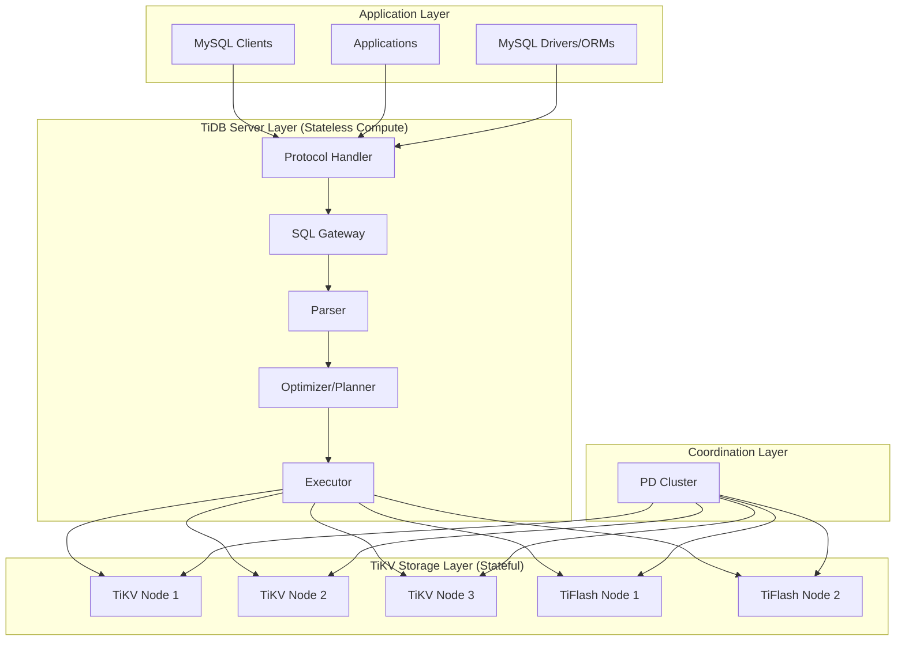
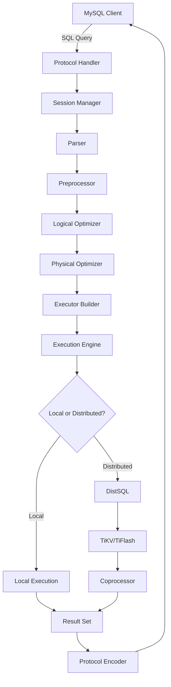
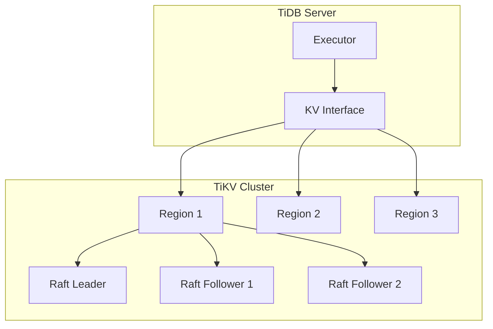
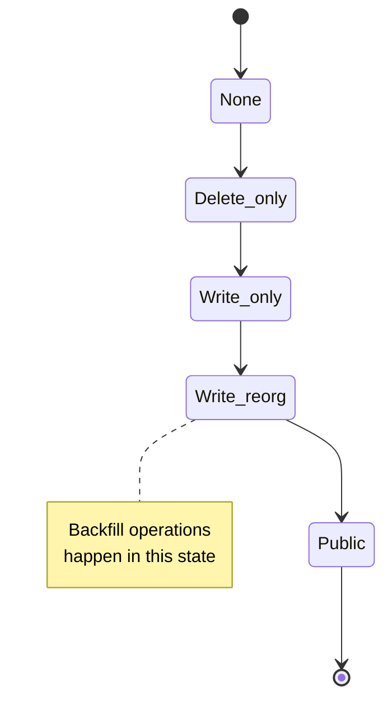

# TiDB Architecture Overview

## Introduction

TiDB is a distributed, horizontally scalable, MySQL-compatible SQL database that combines the best features of traditional RDBMS and NoSQL systems. This document provides a comprehensive overview of TiDB's architecture, focusing on the internal components and their interactions from a developer's perspective.

## High-Level Architecture

TiDB follows a three-tier architecture that separates compute, storage, and coordination layers:

## Core Architectural Principles

### 1. Separation of Concerns
- **Stateless Compute Layer**: TiDB servers handle SQL processing without storing data
- **Stateful Storage Layer**: TiKV handles data persistence and transactions
- **Coordination Layer**: PD manages cluster metadata and scheduling

### 2. Horizontal Scalability
- Add/remove TiDB servers for compute scaling
- Add/remove TiKV nodes for storage scaling
- Automatic data rebalancing and load distribution

### 3. Strong Consistency
- ACID transactions across distributed nodes
- Two-phase commit (2PC) protocol implementation
- Raft consensus for data replication

### 4. MySQL Compatibility
- MySQL 8.0 protocol compatibility
- SQL dialect compatibility
- Existing tools and driver support

## TiDB Server Internal Architecture

### Request Processing Pipeline

### Key Components Overview

#### 1. Protocol Handler (`/pkg/server/`)
- **Purpose**: Implements MySQL wire protocol
- **Key Features**:
  - Connection management and authentication
  - Protocol encoding/decoding
  - Connection pooling and lifecycle management
- **Files**: `server.go`, `conn.go`, `driver_tidb.go`

#### 2. Session Manager (`/pkg/session/`)
- **Purpose**: Manages client sessions and transaction contexts
- **Key Features**:
  - Session variable management
  - Transaction lifecycle control
  - Context propagation
- **Files**: `session.go`, `txn.go`, `bootstrap.go`

#### 3. SQL Parser (`/pkg/parser/`)
- **Purpose**: Converts SQL text into Abstract Syntax Tree (AST)
- **Implementation**: YACC-based parser with lexical analysis
- **Key Features**:
  - MySQL-compatible SQL parsing
  - Error recovery and reporting
  - AST node definitions
- **Files**: `parser.go`, `lexer.go`, `ast/`

#### 4. Query Optimizer (`/pkg/planner/`)
- **Purpose**: Transforms AST into optimal execution plans
- **Two-Stage Optimization**:
  - **Logical Optimization**: Rule-based transformations
  - **Physical Optimization**: Cost-based plan selection
- **Files**: `core/`, `cascades/`, `optimize.go`

#### 5. Execution Engine (`/pkg/executor/`)
- **Purpose**: Executes query plans and returns results
- **Architecture**: Volcano-style iterator model
- **Key Features**:
  - Vectorized execution
  - Distributed execution coordination
  - Operator implementations
- **Files**: `builder.go`, `adapter.go`, `distsql.go`

## Storage Architecture

### TiKV Integration

### Key-Value Abstraction (`/pkg/kv/`)
- **Purpose**: Provides transactional key-value interface
- **Features**:
  - Transaction support (ACID properties)
  - Snapshot isolation
  - Distributed transaction coordination
- **Implementation**: Abstracts over TiKV's gRPC interface

### Transaction Management
- **Two-Phase Commit**: Ensures atomicity across nodes
- **Timestamp Oracle**: Provides globally unique timestamps
- **Lock Management**: Handles distributed locking

## Schema and Metadata Management

### Domain (`/pkg/domain/`)
- **Purpose**: Global state coordination and management
- **Responsibilities**:
  - Schema version management
  - Statistics collection and maintenance
  - Background job coordination
  - Information schema updates

### DDL System (`/pkg/ddl/`)
- **Purpose**: Handles Data Definition Language operations
- **Online DDL**: Non-blocking schema changes
- **State Machine**: Multi-phase DDL execution
- **Features**:
  - Index building and backfilling
  - Table and column operations
  - Partition management

## Data Flow and Component Interactions

### Query Execution Flow

1. **Connection Establishment**
   - Client connects via MySQL protocol
   - Authentication and session initialization
   - Session context creation

2. **SQL Processing**
   - Parse SQL into AST
   - Semantic analysis and validation
   - Privilege checking

3. **Optimization**
   - Logical plan generation
   - Rule-based optimizations
   - Statistics-based cost estimation
   - Physical plan selection

4. **Execution**
   - Execution plan building
   - Operator initialization
   - Data retrieval from TiKV/TiFlash
   - Result processing and formatting

5. **Result Delivery**
   - Protocol encoding
   - Network transmission
   - Connection management

### DDL Operation Flow

1. **DDL Request**
   - Parse DDL statement
   - Validate syntax and semantics
   - Check privileges

2. **Job Scheduling**
   - Create DDL job
   - Queue in DDL job queue
   - Distribute to DDL workers

3. **Execution**
   - State machine progression
   - Coordinate across nodes
   - Handle backfill operations

4. **Completion**
   - Schema version update
   - Notify all nodes
   - Clean up resources

## Configuration and Runtime Management

### Configuration System (`/pkg/config/`)
- **TOML-based**: Human-readable configuration format
- **Hot Reload**: Runtime configuration updates
- **Environment Integration**: Environment variable support
- **Validation**: Configuration validation and defaults

### Monitoring and Observability
- **Metrics**: Prometheus integration for monitoring
- **Tracing**: Jaeger support for distributed tracing
- **Logging**: Structured logging with multiple levels
- **Status API**: HTTP API for runtime information

### Resource Management
- **Memory**: Memory usage tracking and limits
- **CPU**: Execution concurrency control
- **Disk**: Temporary file management
- **Network**: Connection pooling and throttling

## Extensibility and Plugin Architecture

### Plugin System (`/pkg/plugin/`)
- **Audit Plugins**: Query auditing and logging
- **Authentication Plugins**: Custom authentication methods
- **Function Plugins**: User-defined functions
- **Hook System**: Event-driven extension points

### Extension Points
- **Expression Functions**: Custom SQL functions
- **Storage Engines**: Alternative storage backends
- **Optimizer Rules**: Custom optimization rules
- **Protocol Handlers**: Additional protocol support

## Performance Considerations

### Optimization Strategies
- **Vectorized Execution**: Batch processing for performance
- **Predicate Pushdown**: Filter operations pushed to storage
- **Partition Pruning**: Skip irrelevant partitions
- **Index Selection**: Optimal index usage

### Caching Layers
- **Plan Cache**: Reuse execution plans
- **Schema Cache**: Cache schema information
- **Statistics Cache**: Cache table statistics
- **Connection Pool**: Reuse database connections

### Parallel Execution
- **Operator Parallelism**: Parallel operator execution
- **Hash Joins**: Parallel hash join implementation
- **Aggregation**: Parallel aggregation operations
- **Sort**: External sorting with parallelism

## Error Handling and Recovery

### Error Management (`/pkg/errno/`, `/pkg/errctx/`)
- **Error Codes**: MySQL-compatible error codes
- **Error Context**: Rich error information
- **Error Recovery**: Graceful error handling
- **Client Communication**: Error message formatting

### Failure Recovery
- **Connection Recovery**: Automatic reconnection
- **Transaction Recovery**: Transaction rollback and retry
- **DDL Recovery**: Resume interrupted DDL operations
- **Cluster Recovery**: Node failure handling

## Summary

TiDB's architecture demonstrates sophisticated distributed systems design with clear separation of concerns, horizontal scalability, and strong consistency guarantees. The codebase is well-organized with modular components that can be developed, tested, and maintained independently while working together to provide a robust distributed SQL database system.

Key architectural strengths:
- **Modularity**: Clear component boundaries and interfaces
- **Scalability**: Horizontal scaling of compute and storage
- **Consistency**: Strong consistency with distributed transactions
- **Compatibility**: MySQL ecosystem integration
- **Extensibility**: Plugin architecture and extension points

This architecture enables TiDB to serve as both an OLTP and OLAP database while maintaining compatibility with existing MySQL applications and tools.