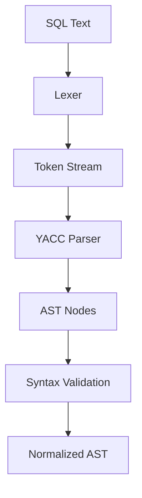
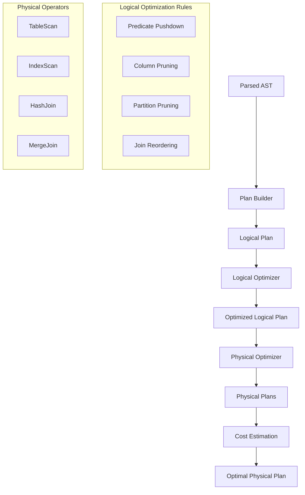
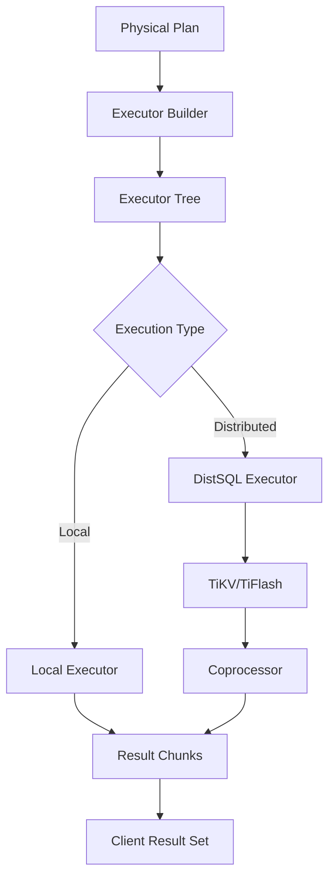
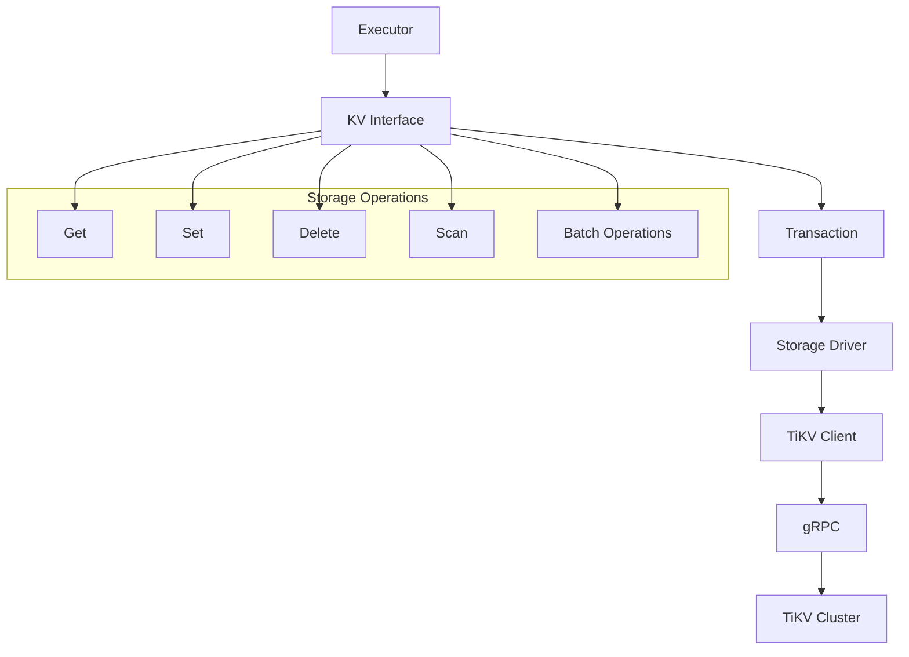
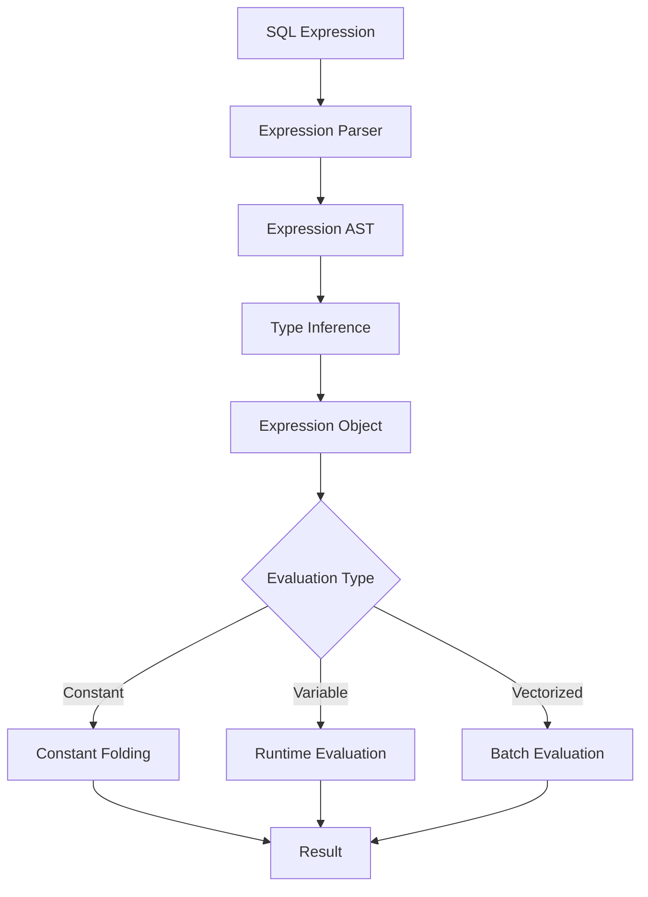

# TiDB Core Components Deep Dive

## Overview

This document provides an in-depth analysis of TiDB's core components, their implementation details, and how they work together to provide a distributed SQL database. Each component is examined from both architectural and implementation perspectives.

## 1. SQL Parser (`/pkg/parser/`)

### Architecture and Design

The TiDB parser is a sophisticated SQL parsing system that converts MySQL-compatible SQL statements into Abstract Syntax Trees (ASTs). It's designed to be highly compatible with MySQL syntax while providing extensibility for TiDB-specific features.



### Key Components

#### Lexical Analysis (`lexer.go`)
```go
// Key structures for tokenization
type Scanner struct {
    r   reader
    buf bytes.Buffer
    // Token state and position tracking
}

// Token types and keyword mapping
var tokenMap = map[string]int{
    "SELECT": yySELECT,
    "FROM":   yyFROM,
    "WHERE":  yyWHERE,
    // ... hundreds of MySQL keywords
}
```

#### Parser Implementation (`parser.go`)
- **Size**: 7.6MB generated Go file
- **Grammar**: YACC-based grammar definition
- **Features**:
  - Full MySQL 8.0 syntax support
  - Error recovery and reporting
  - Lookahead optimization
  - Context-sensitive parsing

#### AST Node Definitions (`ast/`)
```go
// Base interface for all AST nodes
type Node interface {
    Accept(v Visitor) (node Node, ok bool)
    String() string
    Clone() Node
}

// Statement nodes
type SelectStmt struct {
    SelectStmtOpts *SelectStmtOpts
    Fields         *FieldList
    From           *TableRefsClause
    Where          ExprNode
    GroupBy        *GroupByClause
    Having         *HavingClause
    OrderBy        *OrderByClause
    Limit          *Limit
    // ... additional fields
}
```

### Implementation Highlights

#### Expression Parsing
```go
// Expression evaluation during parsing
type ExprNode interface {
    Node
    SetType(tp *types.FieldType)
    GetType() *types.FieldType
    SetFlag(flag uint64)
    GetFlag() uint64
}

// Binary operations
type BinaryOperationExpr struct {
    Op string      // Operator (+, -, *, /, etc.)
    L  ExprNode    // Left operand
    R  ExprNode    // Right operand
}
```

#### MySQL Compatibility Features
- **Charset and Collation**: Full charset support
- **SQL Modes**: MySQL SQL mode compatibility
- **Functions**: 500+ MySQL built-in functions
- **Data Types**: All MySQL data types including JSON

### Error Handling and Recovery
```go
type Error struct {
    Code    int
    Message string
    File    string
    Line    int
}

// Error recovery strategies
func (parser *Parser) yyerror(msg string) {
    // Context-aware error reporting
    // Suggest corrections when possible
    // Maintain parser state for recovery
}
```

### Performance Optimizations
- **Token Caching**: Reduce allocation overhead
- **AST Node Pooling**: Reuse AST nodes
- **Lazy Evaluation**: Defer expensive operations
- **Memory Management**: Careful memory allocation patterns

## 2. Query Planner and Optimizer (`/pkg/planner/`)

### Architecture Overview

TiDB's optimizer uses a two-stage approach: logical optimization followed by physical optimization. This design separates transformation rules from cost-based decisions.



### Logical Optimization (`/pkg/planner/core/`)

#### Rule-Based Optimization
```go
// Optimization rule interface
type logicalOptRule interface {
    optimize(ctx context.Context, p LogicalPlan) (LogicalPlan, error)
}

// Example: Predicate pushdown rule
type predicatePushDown struct{}

func (s *predicatePushDown) optimize(ctx context.Context, p LogicalPlan) (LogicalPlan, error) {
    // Push predicates down the plan tree
    // Reduce data volume early in execution
    return s.pushDownPredicates(p, nil)
}
```

#### Key Logical Operators
```go
// Base logical plan interface
type LogicalPlan interface {
    Plan
    PredicatePushDown([]expression.Expression) ([]expression.Expression, LogicalPlan)
    PruneColumns([]*expression.Column) error
    findBestTask(prop *property.PhysicalProperty) (task, error)
}

// Join operator
type LogicalJoin struct {
    LogicalSchemaProducer
    JoinType JoinType
    OnConditions []expression.Expression
    LeftConditions []expression.Expression
    RightConditions []expression.Expression
}
```

#### Optimization Rules Implementation
1. **Predicate Pushdown**: Move WHERE conditions closer to data sources
2. **Column Pruning**: Eliminate unused columns early
3. **Join Reordering**: Optimize join order for performance
4. **Partition Pruning**: Skip irrelevant partitions
5. **Constant Folding**: Evaluate constant expressions at plan time

### Physical Optimization

#### Cost-Based Optimization
```go
// Cost model for physical operators
type physicalOptimizeOp struct {
    plan PhysicalPlan
    cost float64
}

// Cost estimation interface
type costEstimator interface {
    estimateRowCount() float64
    estimateCost() float64
    estimateMemory() int64
}
```

#### Physical Operators
```go
// Physical table scan
type PhysicalTableScan struct {
    PhysicalSchemaProducer
    Table *model.TableInfo
    Columns []*model.ColumnInfo
    Ranges []*ranger.Range
    Desc bool
}

// Physical index scan
type PhysicalIndexScan struct {
    PhysicalSchemaProducer
    Table *model.TableInfo
    Index *model.IndexInfo
    Ranges []*ranger.Range
    Columns []*model.ColumnInfo
    Desc bool
}
```

#### Join Algorithms
```go
// Hash join implementation
type PhysicalHashJoin struct {
    PhysicalJoin
    Concurrency int
    EqualConditions []*expression.ScalarFunction
    NAEqualConditions []expression.Expression
}

// Merge join for ordered inputs
type PhysicalMergeJoin struct {
    PhysicalJoin
    CompareFuncs []expression.CompareFunc
    Desc bool
}
```

### Statistics-Based Optimization

#### Histogram and Count-Min Sketch
```go
// Table statistics
type Table struct {
    HistColl
    Version int64
    Name string
    RealtimeCount int64
}

// Column histogram
type Histogram struct {
    NDV int64        // Number of distinct values
    Buckets []Bucket // Histogram buckets
    Bounds  []types.Datum
}
```

#### Cardinality Estimation
```go
func (h *Histogram) equalRowCount(value types.Datum) float64 {
    // Estimate rows matching exact value
    // Uses histogram buckets and NDV
}

func (h *Histogram) rangeRowCount(ran *ranger.Range) float64 {
    // Estimate rows in value range
    // Interpolation between histogram bounds
}
```

## 3. Execution Engine (`/pkg/executor/`)

### Execution Architecture

TiDB uses the Volcano execution model with vectorized processing optimizations. The execution engine coordinates between local and distributed execution.



### Executor Framework

#### Base Executor Interface
```go
// Core executor interface
type Executor interface {
    Open(ctx context.Context) error
    Next(ctx context.Context, req *chunk.Chunk) error
    Close() error
    Schema() *expression.Schema
}

// Base executor implementation
type baseExecutor struct {
    ctx           sessionctx.Context
    id            int
    schema        *expression.Schema
    initCap       int
    maxChunkSize  int
    children      []Executor
}
```

#### Chunk-Based Execution
```go
// Columnar data structure
type Chunk struct {
    columns []*Column
    numVirtualRows int
    capacity int
}

// Column represents a column in chunk
type Column struct {
    elemBuf  []byte    // Element buffer
    data     []byte    // Actual data
    nullBitmap []byte  // NULL value bitmap
    offsets  []int64   // Variable length data offsets
}
```

### Key Executors Implementation

#### Table Scan Executor
```go
type TableReaderExecutor struct {
    baseExecutor

    dagPB       *tipb.DAGRequest    // Pushdown expression
    startTS     uint64              // Transaction timestamp
    table       *model.TableInfo    // Table metadata
    ranges      []*ranger.Range     // Scan ranges
    feedback    *statistics.QueryFeedback

    resultHandler *tableResultHandler
}

func (e *TableReaderExecutor) Next(ctx context.Context, req *chunk.Chunk) error {
    // Read data from TiKV using coprocessor
    // Handle distributed execution
    // Convert TiKV response to chunks
}
```

#### Join Executors

##### Hash Join Implementation
```go
type HashJoinExec struct {
    baseExecutor

    probeSideTupleFetcher *probeSideTupleFetcher
    buildSideTupleFetcher *buildSideTupleFetcher
    hashTable             *hashRowContainer
    joiners               []joiner

    concurrency int
    workerWaitGroup sync.WaitGroup
}

func (e *HashJoinExec) fetchAndBuildHashTable(ctx context.Context) error {
    // Build hash table from smaller table
    // Parallel hash table construction
    // Memory management and spilling
}

func (e *HashJoinExec) fetchAndProbeHashTable(ctx context.Context) error {
    // Probe hash table with larger table
    // Parallel probing with multiple workers
    // Result collection and merging
}
```

##### Merge Join Implementation
```go
type MergeJoinExec struct {
    baseExecutor

    stmtCtx    *stmtctx.StatementContext
    compareFuncs []expression.CompareFunc
    joiners    []joiner

    innerTable *mergeJoinTable
    outerTable *mergeJoinTable
}
```

#### Aggregation Executor
```go
type HashAggExec struct {
    baseExecutor

    sc               *stmtctx.StatementContext
    PartialAggFuncs  []aggfuncs.AggFunc
    FinalAggFuncs    []aggfuncs.AggFunc
    GroupByItems     []expression.Expression

    groupMap         map[string][]aggfuncs.AggFunc
    childResult      *chunk.Chunk

    // Parallel execution
    parallelExec *HashAggPartialExec
}
```

### Distributed Execution (DistSQL)

#### Coprocessor Integration
```go
// Coprocessor request building
func (e *TableReaderExecutor) buildDAGReq(ctx context.Context) (*tipb.DAGRequest, error) {
    // Convert execution plan to protobuf
    // Add pushdown expressions
    // Configure execution parameters
    dagReq := &tipb.DAGRequest{
        Executors:     executors,     // Execution DAG
        OutputOffsets: outputOffsets, // Result columns
        Flags:        flags,          // Execution flags
    }
    return dagReq, nil
}

// Handle coprocessor response
func (e *tableResultHandler) nextChunk(ctx context.Context, chk *chunk.Chunk) error {
    // Receive data from TiKV
    // Deserialize chunk data
    // Handle partial results and streaming
}
```

#### Parallel Execution
```go
// Parallel execution coordinator
type parallelHashAggWorker struct {
    baseHashAggWorker
    inputCh   chan *chunk.Chunk
    outputCh  chan *AfFinalResult
    globalMap map[string][]aggfuncs.AggFunc
}

func (w *parallelHashAggWorker) run(ctx context.Context, waitGroup *sync.WaitGroup) {
    // Worker goroutine execution
    // Process input chunks in parallel
    // Coordinate with other workers
}
```

### Memory Management

#### Memory Usage Tracking
```go
type MemoryUsageTracker struct {
    Label         string
    MaxMemory     int64    // Memory limit
    CurMemory     int64    // Current usage
    parent        *MemoryUsageTracker
    mu            sync.Mutex
}

func (m *MemoryUsageTracker) Consume(bytes int64) {
    // Track memory allocation
    // Check against limits
    // Trigger spilling if necessary
}
```

#### Spill-to-Disk Strategy
```go
// Hash table spilling for large joins
func (h *hashRowContainer) spill() error {
    // Write hash table partitions to disk
    // Free memory for continued execution
    // Track spilled partitions for later processing
}
```

### Performance Optimizations

#### Vectorized Operations
```go
// Vectorized comparison
func (c *Column) compareColumn(other *Column, sel []int) []int8 {
    // SIMD-style batch comparisons
    // Process multiple rows simultaneously
    // Reduce function call overhead
}
```

#### Predicate Pushdown to Storage
```go
// Push predicates to TiKV coprocessor
func buildPushedDownPredicate(conditions []expression.Expression) *tipb.Expr {
    // Convert expressions to protobuf
    // Enable storage-level filtering
    // Reduce network data transfer
}
```

## 4. Storage Interface (`/pkg/kv/`, `/pkg/store/`)

### Storage Abstraction Layer

The storage layer provides a clean abstraction over TiKV's distributed key-value store, presenting a transactional interface to the upper layers.



### Key-Value Interface

#### Core Interfaces
```go
// Storage interface
type Storage interface {
    Begin() (Transaction, error)
    BeginWithStartTS(startTS uint64) (Transaction, error)
    GetSnapshot(ver kv.Version) Snapshot
    Close() error
    UUID() string
    CurrentVersion(txnScope string) (Version, error)
}

// Transaction interface
type Transaction interface {
    Get(ctx context.Context, k Key) ([]byte, error)
    BatchGet(ctx context.Context, keys []Key) (map[string][]byte, error)
    Set(k Key, v []byte) error
    Delete(k Key) error
    Commit(ctx context.Context) error
    Rollback() error
    Size() int
    Len() int
}
```

#### Key Encoding and Management
```go
// Table key encoding
func EncodeRowKeyWithHandle(tableID int64, h kv.Handle) kv.Key {
    // Encode table ID and row handle into key
    // Ensures proper key ordering and distribution
    buf := make([]byte, 0, 19)
    buf = appendTableRecordPrefix(buf, tableID)
    buf = h.Encoded(buf)
    return buf
}

// Index key encoding
func EncodeIndexSeekKey(tableID int64, idxID int64, encodedValue []byte) kv.Key {
    // Encode index key with table ID, index ID, and values
    // Enables efficient index scans
    key := make([]byte, 0, prefixLen+len(encodedValue)+9)
    key = appendTableIndexPrefix(key, tableID)
    key = codec.EncodeInt(key, idxID)
    key = append(key, encodedValue...)
    return key
}
```

### Transaction Implementation

#### Two-Phase Commit Protocol
```go
// Two-phase commit coordinator
type twoPhaseCommitter struct {
    sessionID   uint64
    startTS     uint64
    commitTS    uint64
    keys        [][]byte
    mutations   map[string]*pb.Mutation

    // Coordination
    primary     []byte
    forUpdateTS uint64
    txnSize     int
}

func (c *twoPhaseCommitter) execute(ctx context.Context) error {
    // Phase 1: Prewrite all keys
    err := c.prewriteKeys(ctx, c.primary, c.keys)
    if err != nil {
        return err
    }

    // Phase 2: Commit primary key
    commitTS, err := c.commitPrimary(ctx)
    if err != nil {
        return err
    }

    // Phase 3: Commit secondary keys asynchronously
    go c.commitSecondaryKeys(ctx, commitTS)
    return nil
}
```

#### Snapshot Isolation
```go
// Snapshot provides point-in-time view
type tikvSnapshot struct {
    store     *tikvStore
    version   kv.Version
    priority  pb.CommandPri
    keyOnly   bool

    // Read tracking
    scanDetail *util.ScanDetail
    readReqs   []*kv.Request
}

func (s *tikvSnapshot) Get(ctx context.Context, k kv.Key) ([]byte, error) {
    // Read at specific timestamp
    // Consistent view across transactions
    // Handle read conflicts and retries
}
```

### TiKV Client Integration

#### gRPC Communication
```go
// TiKV client for gRPC communication
type rpcClient struct {
    conns    map[string]*grpc.ClientConn
    security config.Security

    // Connection pooling
    connMu   sync.RWMutex
    connPool map[string]*connPool
}

func (c *rpcClient) SendRequest(ctx context.Context, addr string, req *tikvrpc.Request) (*tikvrpc.Response, error) {
    // Send request to TiKV node
    // Handle connection management
    // Implement retry and failover logic
}
```

#### Region and Store Management
```go
// Region cache for routing
type RegionCache struct {
    pdClient  pd.Client
    mu        sync.RWMutex
    regions   map[RegionVerID]*Region
    sorted    *SortedRegions
}

func (c *RegionCache) LocateKey(bo *Backoffer, key []byte) (*KeyLocation, error) {
    // Find TiKV region containing key
    // Cache region information
    // Handle region splits and merges
}
```

## 5. Expression System (`/pkg/expression/`)

### Expression Architecture

The expression system handles all SQL expression evaluation, from simple arithmetic to complex built-in functions.



### Core Expression Types

#### Base Expression Interface
```go
// Expression interface
type Expression interface {
    Eval(row chunk.Row) (types.Datum, error)
    EvalInt(ctx sessionctx.Context, row chunk.Row) (int64, bool, error)
    EvalReal(ctx sessionctx.Context, row chunk.Row) (float64, bool, error)
    EvalString(ctx sessionctx.Context, row chunk.Row) (string, bool, error)

    GetType() *types.FieldType
    Clone() Expression
    Equal(ctx sessionctx.Context, e Expression) bool
    HashCode(sc *stmtctx.StatementContext) []byte
}
```

#### Built-in Functions
```go
// Function signature definition
type builtinFunc struct {
    baseBuiltinFunc

    // Function metadata
    funcName string
    retType  *types.FieldType
    args     []Expression

    // Evaluation contexts
    bufAllocator columnBufferAllocator
}

// Arithmetic functions
type builtinArithmeticPlusRealSig struct {
    baseBuiltinFunc
}

func (b *builtinArithmeticPlusRealSig) evalReal(row chunk.Row) (float64, bool, error) {
    // Evaluate left and right operands
    // Perform addition with overflow checking
    // Return result with null handling
}
```

#### Vectorized Evaluation
```go
// Vectorized function interface
type vecExprEvaluator interface {
    vecEvalInt(input *chunk.Chunk, result *chunk.Column) error
    vecEvalReal(input *chunk.Chunk, result *chunk.Column) error
    vecEvalString(input *chunk.Chunk, result *chunk.Column) error
}

// Batch evaluation for performance
func (b *builtinArithmeticPlusIntSig) vecEvalInt(input *chunk.Chunk, result *chunk.Column) error {
    // Process entire column at once
    // Reduce per-row function call overhead
    // Enable CPU vectorization optimizations
}
```

### Function Categories

#### Mathematical Functions
- Arithmetic: `+`, `-`, `*`, `/`, `%`
- Trigonometric: `SIN`, `COS`, `TAN`, `ATAN2`
- Logarithmic: `LOG`, `LOG10`, `LN`, `EXP`
- Statistical: `ABS`, `CEIL`, `FLOOR`, `ROUND`

#### String Functions
- Manipulation: `CONCAT`, `SUBSTRING`, `REPLACE`, `TRIM`
- Pattern Matching: `LIKE`, `REGEXP`, `MATCH`
- Conversion: `UPPER`, `LOWER`, `ASCII`, `CHAR`
- Information: `LENGTH`, `CHAR_LENGTH`, `POSITION`

#### Date/Time Functions
- Current Values: `NOW()`, `CURDATE()`, `CURTIME()`
- Formatting: `DATE_FORMAT`, `TIME_FORMAT`
- Arithmetic: `DATE_ADD`, `DATE_SUB`, `TIMESTAMPDIFF`
- Extraction: `YEAR`, `MONTH`, `DAY`, `HOUR`

#### JSON Functions
```go
// JSON path evaluation
type builtinJSONExtractSig struct {
    baseBuiltinFunc
}

func (b *builtinJSONExtractSig) evalJSON(row chunk.Row) (types.BinaryJSON, bool, error) {
    // Parse JSON document
    // Evaluate JSON path expression
    // Extract matching values
    // Return as BinaryJSON type
}
```

#### Aggregate Functions
```go
// Aggregate function interface
type AggFunc interface {
    UpdatePartialResult(sctx sessionctx.Context, rowsInGroup []chunk.Row, pr PartialResult) error
    MergePartialResult(sctx sessionctx.Context, src PartialResult, dst PartialResult) error
    AppendFinalResult2Chunk(sctx sessionctx.Context, pr PartialResult, chk *chunk.Chunk) error
}

// COUNT implementation
type countOriginal struct {
    baseAggFunc
}

func (c *countOriginal) UpdatePartialResult(sctx sessionctx.Context, rowsInGroup []chunk.Row, pr PartialResult) error {
    // Count non-null values
    // Handle distinct counting
    // Update partial result
}
```

This comprehensive analysis of TiDB's core components reveals a sophisticated, well-engineered distributed database system. Each component is designed with performance, scalability, and maintainability in mind, following established database architecture patterns while innovating in areas like distributed execution and online DDL operations.