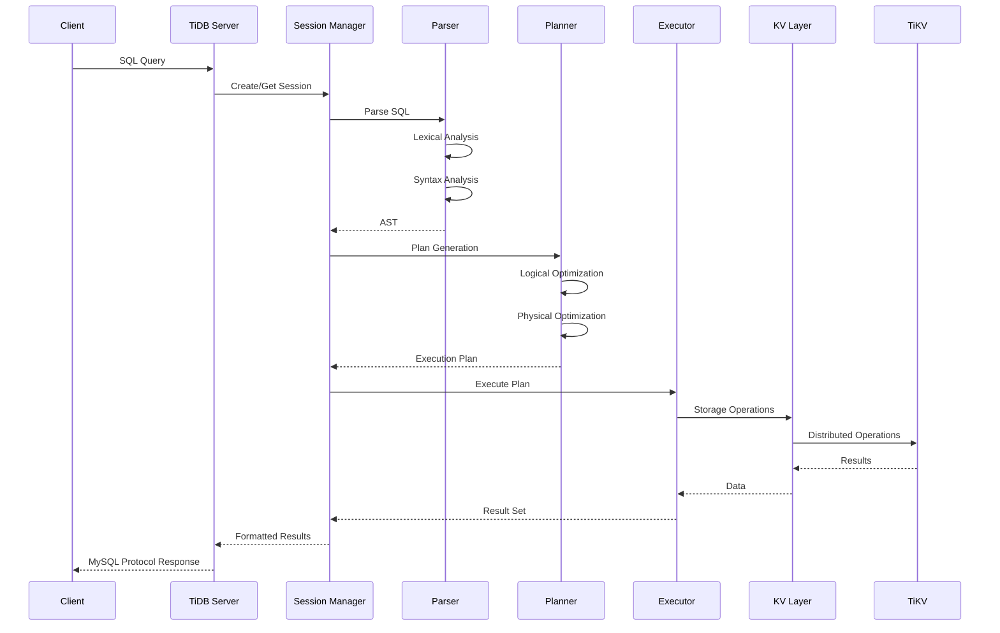
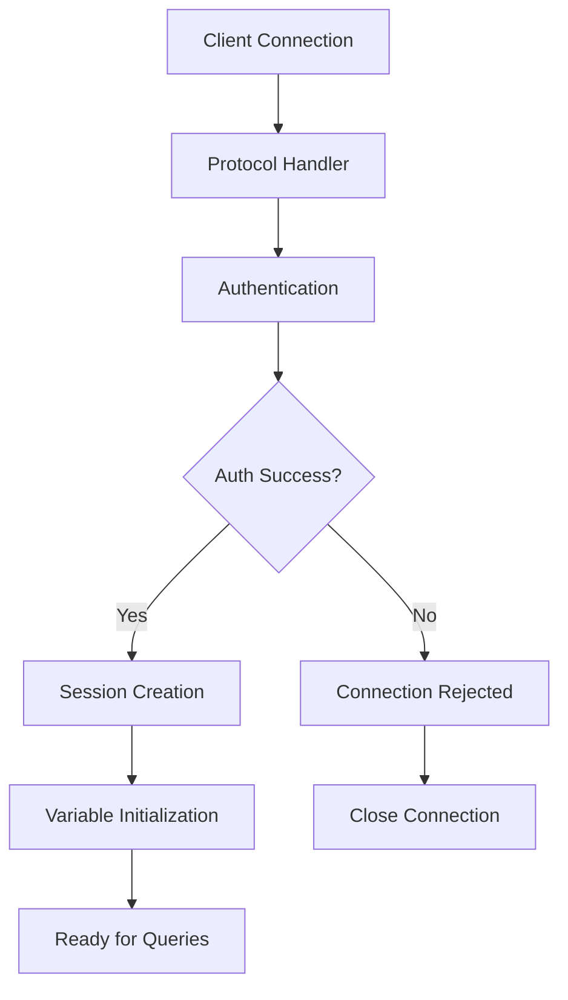
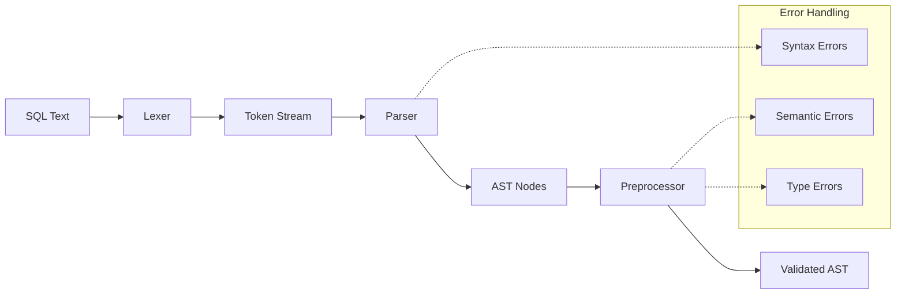
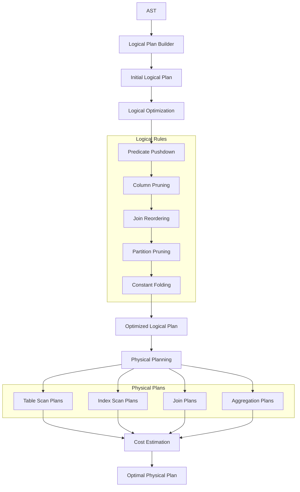
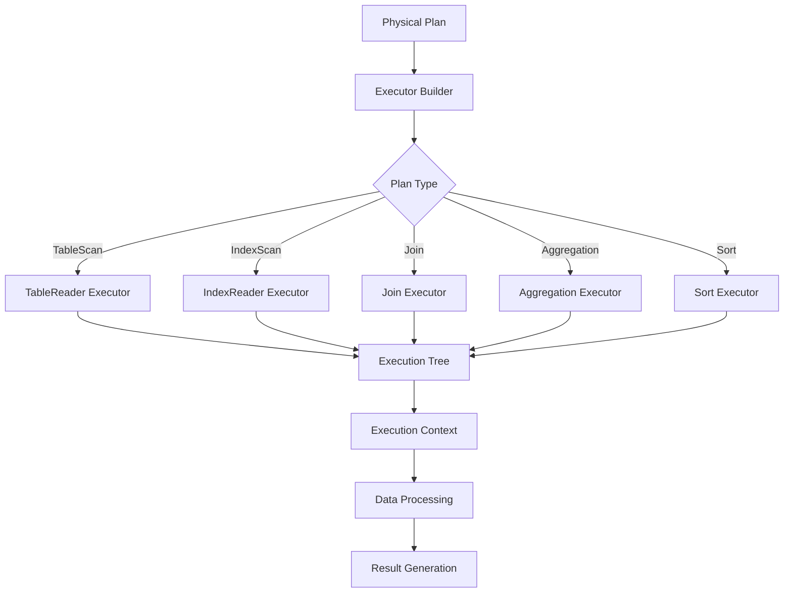
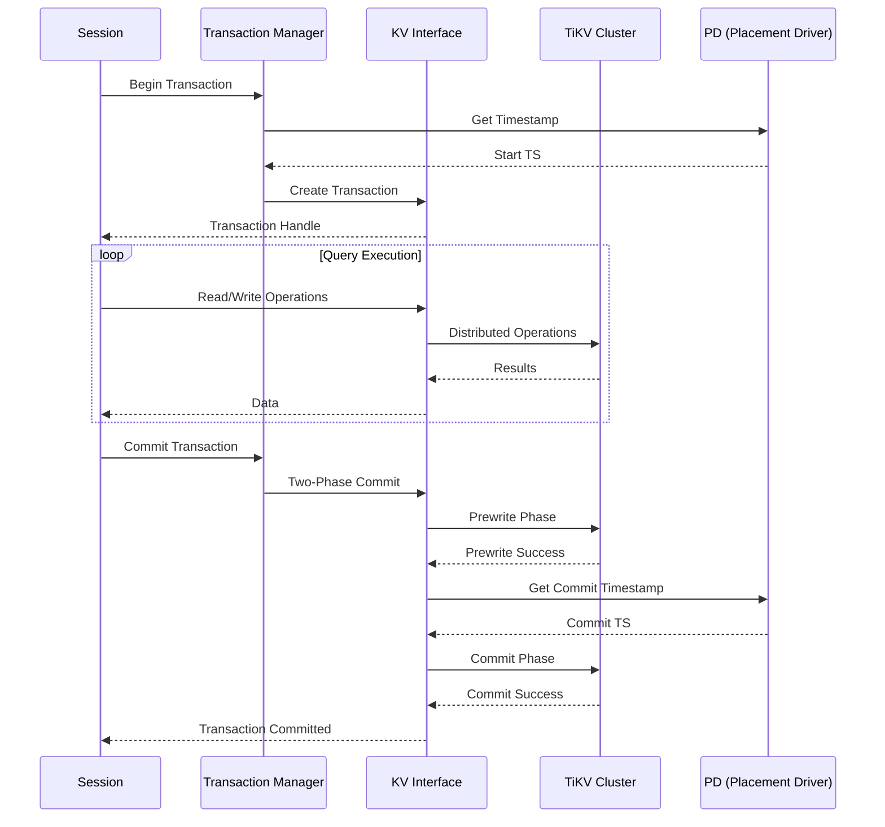
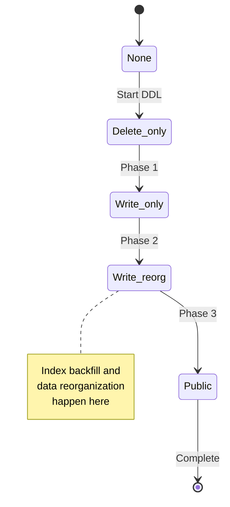
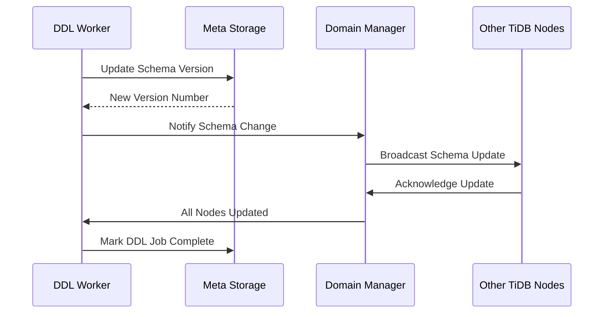
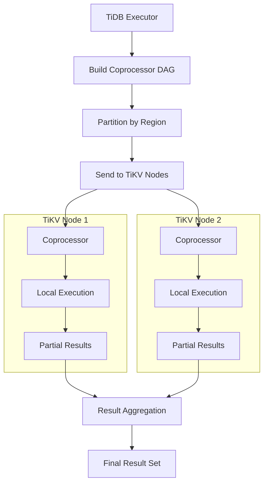
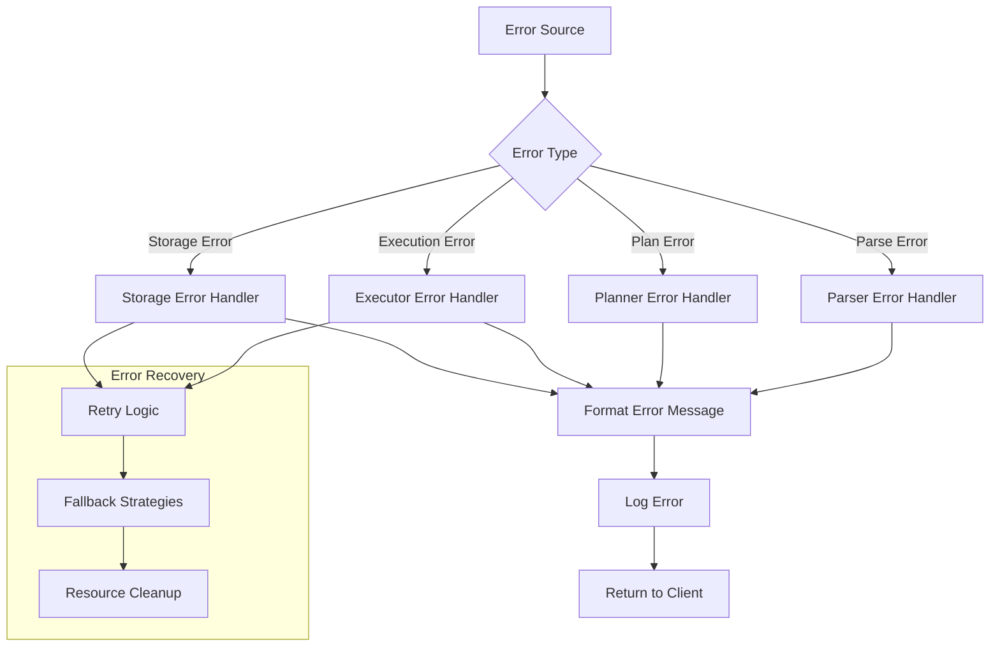

# Module Interactions and Data Flow

## Overview

This document describes how TiDB's various modules interact with each other to process SQL queries, manage transactions, and maintain consistency in a distributed environment. Understanding these interactions is crucial for developers working on TiDB's codebase.

## High-Level Data Flow

### Query Processing Flow



## 1. Connection and Session Management

### Connection Establishment Flow



#### Implementation Details

**Connection Handler (`/pkg/server/conn.go`)**
```go
// Connection handling lifecycle
func (cc *clientConn) Run(ctx context.Context) {
    // 1. Connection setup and authentication
    if err := cc.openSessionAndDoAuth(); err != nil {
        return
    }

    // 2. Command processing loop
    for {
        data, err := cc.readPacket()
        if err != nil {
            break
        }

        if err := cc.dispatch(ctx, data); err != nil {
            break
        }
    }

    // 3. Cleanup and connection close
    cc.cleanup()
}
```

**Session Management (`/pkg/session/session.go`)**
```go
type session struct {
    // Core session state
    sessionVars  *variable.SessionVars
    store        kv.Storage
    txn          kv.Transaction

    // Statement execution context
    stmtCtx      *stmtctx.StatementContext
    mu           sync.RWMutex

    // Resource tracking
    memTracker   *memory.Tracker
    diskTracker  *disk.Tracker
}

func (s *session) Execute(ctx context.Context, sql string) ([]sqlexec.RecordSet, error) {
    // 1. Parse SQL statements
    stmts, err := s.parse(ctx, sql)

    // 2. Execute each statement
    for _, stmt := range stmts {
        recordSet, err := s.executeStatement(ctx, stmt)
        if err != nil {
            return nil, err
        }
        recordSets = append(recordSets, recordSet)
    }

    return recordSets, nil
}
```

## 2. SQL Processing Pipeline

### Parser Integration

The parser module converts SQL text into Abstract Syntax Trees (ASTs) that can be processed by the planner.



#### Parser-to-Planner Interface
```go
// AST to logical plan conversion
func (b *PlanBuilder) Build(ctx context.Context, node ast.Node) (Plan, error) {
    switch x := node.(type) {
    case *ast.SelectStmt:
        return b.buildSelect(ctx, x)
    case *ast.InsertStmt:
        return b.buildInsert(ctx, x)
    case *ast.UpdateStmt:
        return b.buildUpdate(ctx, x)
    case *ast.DeleteStmt:
        return b.buildDelete(ctx, x)
    // ... other statement types
    }
}

// Example: SELECT statement processing
func (b *PlanBuilder) buildSelect(ctx context.Context, sel *ast.SelectStmt) (LogicalPlan, error) {
    // 1. Build FROM clause (tables and joins)
    p, err := b.buildResultSetNode(ctx, sel.From.TableRefs)

    // 2. Process WHERE clause
    if sel.Where != nil {
        p, err = b.buildSelection(ctx, p, sel.Where, nil)
    }

    // 3. Process GROUP BY
    if sel.GroupBy != nil {
        p, err = b.buildAggregation(ctx, p, sel.GroupBy.Items, sel.Fields.Fields)
    }

    // 4. Process ORDER BY and LIMIT
    if sel.OrderBy != nil {
        p, err = b.buildSort(ctx, p, sel.OrderBy.Items, nil, nil)
    }

    return p, err
}
```

### Planner Workflow

The planner transforms ASTs into optimized execution plans through multiple phases.



#### Optimization Rule Application
```go
// Logical optimization rule engine
type logicalOptimizeRule interface {
    optimize(context.Context, LogicalPlan) (LogicalPlan, error)
}

// Rule application sequence
var optRuleList = []logicalOptimizeRule{
    &columnPruner{},           // Remove unused columns
    &buildKeySolver{},         // Identify unique keys
    &decorrelateSolver{},      // Remove correlated subqueries
    &aggregationEliminator{},  // Eliminate unnecessary aggregations
    &projectionEliminator{},   // Remove redundant projections
    &maxMinEliminator{},       // Optimize MAX/MIN queries
    &ppdSolver{},              // Predicate pushdown
    &partitionProcessor{},     // Partition pruning
    &pushDownTopNOptimizer{},  // Push down LIMIT operations
    &joinReOrderSolver{},      // Optimize join order
}

func logicalOptimize(ctx context.Context, flag uint64, logic LogicalPlan) (LogicalPlan, error) {
    var err error
    for i, rule := range optRuleList {
        // Apply rule if enabled by flag
        if flag&(1<<uint(i)) == 0 {
            continue
        }

        logic, err = rule.optimize(ctx, logic)
        if err != nil {
            return nil, err
        }
    }
    return logic, nil
}
```

### Executor Construction and Execution

The executor builds an execution tree from physical plans and manages query execution.



#### Executor Building Process
```go
// Executor builder converts physical plans to executors
type ExecutorBuilder struct {
    ctx      sessionctx.Context
    is       infoschema.InfoSchema
    priority int

    // Resource management
    memTracker *memory.Tracker
    diskTracker *disk.Tracker
}

func (b *ExecutorBuilder) build(p base.PhysicalPlan) Executor {
    switch v := p.(type) {
    case *plannercore.PhysicalProjection:
        return b.buildProjection(v)
    case *plannercore.PhysicalTableScan:
        return b.buildTableScan(v)
    case *plannercore.PhysicalIndexScan:
        return b.buildIndexScan(v)
    case *plannercore.PhysicalHashJoin:
        return b.buildHashJoin(v)
    case *plannercore.PhysicalHashAgg:
        return b.buildHashAgg(v)
    // ... other executor types
    }
}

// Example: Hash join executor building
func (b *ExecutorBuilder) buildHashJoin(v *plannercore.PhysicalHashJoin) Executor {
    leftExec := b.build(v.Children()[0])
    rightExec := b.build(v.Children()[1])

    e := &HashJoinExec{
        baseExecutor: newBaseExecutor(b.ctx, v.Schema(), v.ID(), leftExec, rightExec),
        probeSideTupleFetcher: &probeSideTupleFetcher{},
        buildSideTupleFetcher: &buildSideTupleFetcher{},
        concurrency: v.Concurrency,
    }

    // Configure join conditions and executors
    e.buildJoinConditions(v)
    return e
}
```

## 3. Transaction and Storage Integration

### Transaction Lifecycle



#### Transaction Management Implementation
```go
// Transaction interface implementation
type Transaction struct {
    us       UnionStore          // Local buffer for reads/writes
    store    Storage            // Storage backend
    startTS  uint64            // Transaction start timestamp
    commitTS uint64            // Transaction commit timestamp
    valid    bool              // Transaction validity flag

    // Concurrency control
    lockKeys [][]byte          // Keys locked by this transaction
    mu       sync.Mutex        // Transaction state mutex
}

func (txn *Transaction) Commit(ctx context.Context) error {
    // 1. Validate transaction state
    if !txn.valid {
        return kv.ErrInvalidTxn
    }

    // 2. Get buffered mutations
    mutations := txn.us.GetMemBuffer().GetMutations()
    if len(mutations) == 0 {
        return nil // Read-only transaction
    }

    // 3. Execute two-phase commit
    committer := newTwoPhaseCommitter(txn, 0)
    return committer.execute(ctx)
}
```

### Storage Layer Interactions

#### KV Interface to TiKV Communication
```go
// Storage interface implementation
type Storage struct {
    client   *tikv.Client      // TiKV client
    pdClient pd.Client         // PD client for metadata
    uuid     string            // Storage instance UUID

    // Connection management
    regionCache *tikv.RegionCache
    lockResolver *tikv.LockResolver
}

// Key-value operations
func (s *Storage) Get(ctx context.Context, key []byte) ([]byte, error) {
    // 1. Locate region containing the key
    loc, err := s.regionCache.LocateKey(key)
    if err != nil {
        return nil, err
    }

    // 2. Send get request to appropriate TiKV node
    req := &kvrpcpb.GetRequest{
        Key:     key,
        Version: s.version,
    }

    resp, err := s.client.SendReq(ctx, req, loc.Region, tikv.ReadTimeoutMedium)
    if err != nil {
        return nil, err
    }

    return resp.Value, nil
}

// Batch operations for efficiency
func (s *Storage) BatchGet(ctx context.Context, keys [][]byte) (map[string][]byte, error) {
    // 1. Group keys by region
    regionMap := make(map[tikv.RegionVerID][][]byte)
    for _, key := range keys {
        loc, err := s.regionCache.LocateKey(key)
        if err != nil {
            return nil, err
        }
        regionMap[loc.Region.VerID()] = append(regionMap[loc.Region.VerID()], key)
    }

    // 2. Send parallel requests to each region
    results := make(map[string][]byte)
    for regionID, regionKeys := range regionMap {
        resp, err := s.batchGetFromRegion(ctx, regionKeys, regionID)
        if err != nil {
            return nil, err
        }

        // Merge results
        for k, v := range resp {
            results[k] = v
        }
    }

    return results, nil
}
```

## 4. DDL Operations and Schema Management

### DDL State Machine

DDL operations in TiDB follow a state machine pattern to ensure consistency across all nodes in the cluster.



#### DDL Worker and Job Processing
```go
// DDL job processing
type worker struct {
    id              int
    tp              workerType      // DDL worker type
    ddlJobCh        chan struct{}   // Job notification channel
    ctx             context.Context
    wg              sync.WaitGroup

    // State management
    sess            session.Session  // Database session
    delRangeManager delRangeManager  // Cleanup manager
}

func (w *worker) start(d *ddl) {
    defer w.wg.Done()

    for {
        select {
        case <-w.ddlJobCh:
            // Process pending DDL jobs
            err := w.handleDDLJobQueue(d)
            if err != nil {
                log.Error("handle DDL job failed", zap.Error(err))
            }
        case <-w.ctx.Done():
            return
        }
    }
}

// DDL job execution
func (w *worker) runDDLJob(d *ddl, t *meta.Meta, job *model.Job) error {
    // Execute job based on type
    switch job.Type {
    case model.ActionCreateTable:
        return w.onCreateTable(d, t, job)
    case model.ActionAddIndex:
        return w.onCreateIndex(d, t, job)
    case model.ActionDropTable:
        return w.onDropTable(d, t, job)
    case model.ActionModifyColumn:
        return w.onModifyColumn(d, t, job)
    // ... other DDL operations
    }
}
```

### Schema Version Management



#### Schema Change Coordination
```go
// Domain manages global schema state
type Domain struct {
    store           kv.Storage
    infoSchema      infoschema.InfoSchema
    ddl             ddl.DDL

    // Schema version management
    schemaValidator SchemaValidator
    m               sync.Mutex

    // Background workers
    wg              sync.WaitGroup
    ctx             context.Context
}

func (do *Domain) Reload() error {
    // 1. Get latest schema version from storage
    latestVersion, err := do.store.CurrentVersion(oracle.GlobalTxnScope)
    if err != nil {
        return err
    }

    // 2. Check if schema needs update
    currentVersion := do.infoSchema.SchemaMetaVersion()
    if latestVersion.Ver <= currentVersion {
        return nil // Already up to date
    }

    // 3. Load new schema information
    newInfoSchema, err := do.loadInfoSchema(latestVersion.Ver)
    if err != nil {
        return err
    }

    // 4. Update domain's schema
    do.m.Lock()
    do.infoSchema = newInfoSchema
    do.m.Unlock()

    return nil
}
```

## 5. Distributed Execution Coordination

### DistSQL Processing

TiDB coordinates distributed execution by pushing computation to TiKV nodes through the coprocessor framework.



#### Coprocessor Request Building
```go
// Build coprocessor DAG request
func (e *TableReaderExecutor) buildDAGReq() (*tipb.DAGRequest, error) {
    // 1. Build execution DAG for pushdown
    dagReq := &tipb.DAGRequest{
        TimeZoneOffset: timeZoneOffset,
        Flags:         sc.PushDownFlags(),
    }

    // 2. Add table scan executor
    ts := &tipb.TableScan{
        TableId:          e.table.ID,
        Columns:          util.ColumnsToProto(e.columns, e.table.PKIsHandle),
        Desc:            e.desc,
    }

    // 3. Add selection conditions if any
    if len(e.conditions) > 0 {
        sel := &tipb.Selection{
            Conditions: expression.PBExpr(e.conditions),
        }
        dagReq.Executors = append(dagReq.Executors, &tipb.Executor{
            Tp:        tipb.ExecType_TypeSelection,
            Selection: sel,
        })
    }

    // 4. Add aggregation if needed
    if e.aggInfo != nil {
        agg := &tipb.Aggregation{
            GroupBy:     e.aggInfo.GroupBy,
            AggFunc:     e.aggInfo.AggFuncs,
        }
        dagReq.Executors = append(dagReq.Executors, &tipb.Executor{
            Tp:  tipb.ExecType_TypeAggregation,
            Agg: agg,
        })
    }

    return dagReq, nil
}

// Execute distributed request
func (e *TableReaderExecutor) Next(ctx context.Context, req *chunk.Chunk) error {
    // 1. Build coprocessor request
    dagReq, err := e.buildDAGReq()
    if err != nil {
        return err
    }

    // 2. Send to appropriate TiKV regions
    result, err := distsql.Select(ctx, e.ctx, dagReq, e.kvRanges, e.feedback)
    if err != nil {
        return err
    }

    // 3. Process streaming results
    for {
        partialResult, err := result.Next(ctx)
        if err != nil {
            return err
        }
        if partialResult == nil {
            break // No more results
        }

        // Convert to chunk format
        err = e.resultHandler.processPartialResult(partialResult, req)
        if err != nil {
            return err
        }
    }

    return nil
}
```

## 6. Error Handling and Recovery

### Error Propagation



#### Error Context and Handling
```go
// Error context for detailed error information
type StatementContext struct {
    // Error tracking
    warnings        []SQLWarn
    warningCount    uint16
    errorCount      uint16

    // Execution context
    timeZone        *time.Location
    memTracker      *memory.Tracker
    diskTracker     *disk.Tracker

    // Flags and settings
    ignoreZeroInDate bool
    truncateAsWarning bool
}

// Error handling in executors
func (e *HashJoinExec) Next(ctx context.Context, req *chunk.Chunk) error {
    defer func() {
        if r := recover(); r != nil {
            // Handle panic and convert to error
            err := errors.Errorf("HashJoin panicked: %v", r)
            e.ctx.GetSessionVars().StmtCtx.AppendError(err)
        }
    }()

    // Execute with error checking
    err := e.joinWorker.fetchAndJoin(ctx, req)
    if err != nil {
        // Check if error is retryable
        if tikverr.IsRetryableError(err) {
            return e.handleRetryableError(err)
        }
        return err
    }

    return nil
}

// Retry logic for distributed operations
func (e *TableReaderExecutor) handleRetryableError(err error) error {
    const maxRetries = 3

    for i := 0; i < maxRetries; i++ {
        // Exponential backoff
        time.Sleep(time.Duration(1<<uint(i)) * 100 * time.Millisecond)

        // Retry the operation
        err = e.retryOperation()
        if err == nil {
            return nil
        }

        if !tikverr.IsRetryableError(err) {
            break // Non-retryable error
        }
    }

    return err
}
```

## Summary

The module interactions in TiDB demonstrate a well-architected distributed system with clear separation of concerns and robust error handling. Key patterns include:

1. **Layered Architecture**: Clean separation between protocol, SQL processing, and storage layers
2. **Asynchronous Processing**: Extensive use of goroutines and channels for concurrent operations
3. **Error Recovery**: Comprehensive retry and fallback mechanisms
4. **Resource Management**: Careful tracking of memory, disk, and network resources
5. **Distributed Coordination**: Sophisticated mechanisms for maintaining consistency across nodes

Understanding these interactions is essential for:
- **Debugging**: Tracing issues across module boundaries
- **Performance Optimization**: Identifying bottlenecks in the processing pipeline
- **Feature Development**: Adding new functionality that integrates properly with existing systems
- **Maintenance**: Understanding the impact of changes across the system

This modular design enables TiDB to scale horizontally while maintaining ACID properties and MySQL compatibility, making it suitable for demanding distributed database workloads.