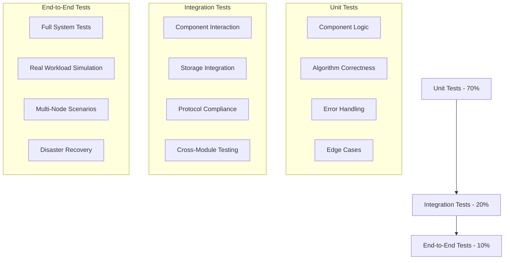

# TiDB Testing Strategies and Framework

## Overview

TiDB employs a comprehensive multi-layered testing strategy to ensure reliability, performance, and correctness across its distributed database components. This document details the testing frameworks, strategies, and best practices used in TiDB development.

## Table of Contents

1. [Testing Philosophy](#testing-philosophy)
2. [Test Organization and Structure](#test-organization-and-structure)
3. [Unit Testing Framework](#unit-testing-framework)
4. [Integration Testing](#integration-testing)
5. [End-to-End Testing](#end-to-end-testing)
6. [Performance and Benchmark Testing](#performance-and-benchmark-testing)
7. [Fault Injection and Chaos Testing](#fault-injection-and-chaos-testing)
8. [Test Utilities and Frameworks](#test-utilities-and-frameworks)
9. [CI/CD Testing Pipeline](#cicd-testing-pipeline)
10. [Testing Best Practices](#testing-best-practices)

## Testing Philosophy

### Test Pyramid Strategy

TiDB follows the test pyramid approach with emphasis on fast, reliable unit tests at the base and comprehensive integration tests for distributed scenarios.



### Testing Principles

1. **Fast Feedback**: Unit tests provide immediate feedback during development
2. **Deterministic**: Tests produce consistent results across environments
3. **Isolated**: Tests don't depend on external state or other tests
4. **Comprehensive**: Cover happy paths, edge cases, and error conditions
5. **Realistic**: Integration tests use realistic data and scenarios
6. **Automated**: All tests run automatically in CI/CD pipelines

## Test Organization and Structure

### Directory Structure

```
tidb/
├── pkg/
│   ├── executor/
│   │   ├── executor.go
│   │   ├── executor_test.go          # Unit tests
│   │   ├── benchmark_test.go         # Benchmarks
│   │   └── example_test.go           # Usage examples
│   ├── parser/
│   │   ├── parser_test.go
│   │   └── fuzz_test.go              # Fuzz testing
│   └── planner/
│       ├── core/
│       │   ├── logical_plan_test.go
│       │   └── cost_test.go
│       └── cascades/
│           └── optimizer_test.go
├── tests/
│   ├── integrationtest/              # Integration tests
│   │   ├── r/                        # Test result files
│   │   ├── t/                        # Test SQL files
│   │   └── main_test.go
│   ├── realtikvtest/                 # Tests with real TiKV
│   │   ├── sessiontest/
│   │   ├── ddltest/
│   │   └── txntest/
│   ├── clustertest/                  # Multi-node cluster tests
│   └── benchtest/                    # Performance benchmarks
└── testkit/                          # Testing utilities
    ├── testkit.go
    ├── mockstore/
    └── external/
```

### Test Naming Conventions

```go
// Function naming patterns
func TestExecutorBasicOperations(t *testing.T)     // Basic functionality
func TestExecutorErrorHandling(t *testing.T)       // Error conditions
func TestExecutorEdgeCases(t *testing.T)           // Edge cases
func TestExecutorConcurrency(t *testing.T)         // Concurrency scenarios

func BenchmarkHashJoinLargeData(b *testing.B)      // Performance benchmarks
func ExampleHashJoinUsage()                        // Usage examples

// Table-driven test naming
func TestJoinAlgorithms(t *testing.T) {
    tests := []struct {
        name     string
        joinType JoinType
        // ...
    }{
        {"inner_join_basic", InnerJoin},
        {"left_join_with_nulls", LeftOuterJoin},
        // ...
    }
}
```

## Unit Testing Framework

### Core Testing Infrastructure

#### TestKit Framework

TiDB's TestKit provides a high-level interface for SQL testing with automatic setup and cleanup.

```go
// Basic TestKit usage
func TestSelectStatement(t *testing.T) {
    store, clean := testkit.CreateMockStore(t)
    defer clean()

    tk := testkit.NewTestKit(t, store)
    tk.MustExec("use test")

    // Setup test data
    tk.MustExec("create table t(id int, name varchar(20))")
    tk.MustExec("insert into t values (1, 'alice'), (2, 'bob')")

    // Test query execution
    result := tk.MustQuery("select name from t where id = 1")
    result.Check(testkit.Rows("alice"))

    // Test error conditions
    tk.MustGetErrCode("select * from non_exist_table", mysql.ErrNoSuchTable)
}

// Advanced TestKit usage with custom configuration
func TestTransactionIsolation(t *testing.T) {
    store, clean := testkit.CreateMockStore(t)
    defer clean()

    // Create multiple sessions for isolation testing
    tk1 := testkit.NewTestKit(t, store)
    tk2 := testkit.NewTestKit(t, store)

    tk1.MustExec("use test")
    tk2.MustExec("use test")

    // Setup isolation level
    tk1.MustExec("set transaction isolation level read committed")
    tk2.MustExec("set transaction isolation level read committed")

    // Test concurrent transactions
    tk1.MustExec("begin")
    tk2.MustExec("begin")

    tk1.MustExec("create table t(id int)")
    tk1.MustExec("insert into t values (1)")

    // tk2 should not see uncommitted changes
    tk2.MustQuery("select count(*) from t").Check(testkit.Rows("0"))

    tk1.MustExec("commit")

    // Now tk2 should see the committed data
    tk2.MustQuery("select count(*) from t").Check(testkit.Rows("1"))
    tk2.MustExec("commit")
}
```

#### Mock Frameworks

```go
// Mock session context for unit testing
func createMockSessionCtx() sessionctx.Context {
    ctx := mock.NewContext()
    ctx.GetSessionVars().StmtCtx = &stmtctx.StatementContext{
        TimeZone:          time.UTC,
        SqlMode:          mysql.ModeStrictTransTables,
        IgnoreTruncate:   false,
        TruncateAsWarning: false,
    }
    return ctx
}

// Mock storage for isolated testing
func createMockStore() kv.Storage {
    store, err := mockstore.NewMockStore()
    if err != nil {
        panic(err)
    }
    return store
}

// Mock executor for testing complex scenarios
type mockExecutor struct {
    baseExecutor
    data [][]interface{}
    pos  int
}

func (m *mockExecutor) Next(ctx context.Context, req *chunk.Chunk) error {
    if m.pos >= len(m.data) {
        req.Reset()
        return nil
    }

    for i := 0; i < req.Capacity() && m.pos < len(m.data); i++ {
        row := m.data[m.pos]
        req.AppendRow(chunk.MutRowFromValues(row...))
        m.pos++
    }

    return nil
}

func newMockExecutor(data [][]interface{}) *mockExecutor {
    return &mockExecutor{
        data: data,
        pos:  0,
    }
}
```

### Test Patterns and Examples

#### Table-Driven Tests

```go
func TestArithmeticOperations(t *testing.T) {
    tests := []struct {
        name     string
        expr     string
        expected interface{}
        hasError bool
    }{
        {
            name:     "addition_integers",
            expr:     "1 + 2",
            expected: 3,
        },
        {
            name:     "division_by_zero",
            expr:     "1 / 0",
            hasError: true,
        },
        {
            name:     "overflow_detection",
            expr:     fmt.Sprintf("%d + 1", math.MaxInt64),
            hasError: true,
        },
        {
            name:     "floating_point_precision",
            expr:     "0.1 + 0.2",
            expected: 0.30000000000000004, // IEEE 754 reality
        },
    }

    for _, tt := range tests {
        t.Run(tt.name, func(t *testing.T) {
            store, clean := testkit.CreateMockStore(t)
            defer clean()

            tk := testkit.NewTestKit(t, store)

            if tt.hasError {
                tk.MustGetErrMsg(fmt.Sprintf("select %s", tt.expr), "division by zero")
            } else {
                result := tk.MustQuery(fmt.Sprintf("select %s", tt.expr))
                result.Check(testkit.Rows(fmt.Sprintf("%v", tt.expected)))
            }
        })
    }
}
```

#### Property-Based Testing

```go
func TestJoinCommutativity(t *testing.T) {
    // Property: A JOIN B should produce same results as B JOIN A for INNER JOIN
    quick.Check(func(leftData, rightData []testRow) bool {
        store, clean := testkit.CreateMockStore(t)
        defer clean()

        tk := testkit.NewTestKit(t, store)
        tk.MustExec("use test")

        // Setup tables with random data
        setupTestTables(tk, leftData, rightData)

        // Execute both join orders
        result1 := tk.MustQuery("select * from t1 inner join t2 on t1.id = t2.id order by t1.id, t2.id")
        result2 := tk.MustQuery("select * from t2 inner join t1 on t2.id = t1.id order by t1.id, t2.id")

        // Results should be identical
        return reflect.DeepEqual(result1.Rows(), result2.Rows())
    }, nil)
}

type testRow struct {
    ID   int
    Name string
}

func (tr testRow) Generate(rand *rand.Rand, size int) reflect.Value {
    return reflect.ValueOf(testRow{
        ID:   rand.Intn(100),
        Name: fmt.Sprintf("name_%d", rand.Intn(1000)),
    })
}
```

#### Error Injection Testing

```go
func TestExecutorErrorRecovery(t *testing.T) {
    store, clean := testkit.CreateMockStore(t)
    defer clean()

    tk := testkit.NewTestKit(t, store)
    tk.MustExec("use test")

    // Setup test data
    tk.MustExec("create table t(id int, data blob)")
    tk.MustExec("insert into t values (1, 'test data')")

    // Test memory pressure simulation
    require.NoError(t, failpoint.Enable("github.com/pingcap/tidb/executor/mockMemoryPressure", "return"))
    defer func() {
        require.NoError(t, failpoint.Disable("github.com/pingcap/tidb/executor/mockMemoryPressure"))
    }()

    // Executor should handle memory pressure gracefully
    _, err := tk.Exec("select * from t")
    require.Error(t, err)
    require.Contains(t, err.Error(), "memory limit exceeded")

    // After disabling failpoint, execution should work
    require.NoError(t, failpoint.Disable("github.com/pingcap/tidb/executor/mockMemoryPressure"))
    tk.MustQuery("select count(*) from t").Check(testkit.Rows("1"))
}
```

## Integration Testing

### Integration Test Framework

Integration tests verify component interactions and system behavior with realistic scenarios.

```go
// Integration test structure
type IntegrationSuite struct {
    store kv.Storage
    dom   *domain.Domain
}

func (s *IntegrationSuite) SetupSuite() {
    // Setup persistent test environment
    var err error
    s.store, err = mockstore.NewMockStore()
    require.NoError(s.T(), err)

    s.dom, err = session.BootstrapSession(s.store)
    require.NoError(s.T(), err)
}

func (s *IntegrationSuite) TearDownSuite() {
    s.dom.Close()
    s.store.Close()
}

func (s *IntegrationSuite) TestCrossComponentInteraction() {
    tk := testkit.NewTestKit(s.T(), s.store)
    tk.MustExec("use test")

    // Test parser -> planner -> executor pipeline
    tk.MustExec("create table t(id int primary key, name varchar(50), age int, key idx_age(age))")

    // Insert test data
    for i := 0; i < 1000; i++ {
        tk.MustExec(fmt.Sprintf("insert into t values (%d, 'user_%d', %d)",
            i, i, rand.Intn(100)))
    }

    // Analyze table for statistics
    tk.MustExec("analyze table t")

    // Test complex query optimization
    result := tk.MustQuery(`
        explain analyze
        select /*+ USE_INDEX(t, idx_age) */ name
        from t
        where age > 50
        order by age
        limit 10
    `)

    // Verify index usage
    rows := result.Rows()
    require.Contains(s.T(), fmt.Sprintf("%v", rows[0]), "IndexLookUp")
    require.Contains(s.T(), fmt.Sprintf("%v", rows[0]), "idx_age")
}
```

### Real TiKV Integration Tests

Tests that require actual TiKV deployment for realistic distributed scenarios.

```go
// +build realtikvtest

package realtikvtest

func TestDistributedTransaction(t *testing.T) {
    cluster := setupRealTiKVCluster(t)
    defer cluster.Shutdown()

    store := cluster.GetStore()
    tk := testkit.NewTestKit(t, store)
    tk.MustExec("use test")

    // Test distributed transaction across multiple regions
    tk.MustExec("create table t(id int primary key, data varchar(100))")

    // Insert data that will be distributed across regions
    tk.MustExec("begin")
    for i := 0; i < 10000; i++ {
        tk.MustExec(fmt.Sprintf("insert into t values (%d, 'data_%d')", i, i))
    }
    tk.MustExec("commit")

    // Verify data consistency across regions
    result := tk.MustQuery("select count(*) from t")
    result.Check(testkit.Rows("10000"))

    // Test region split and merge scenarios
    cluster.SplitRegion("test", "t", 5000)

    // Data should still be accessible after region operations
    tk.MustQuery("select count(*) from t where id < 5000").Check(testkit.Rows("5000"))
    tk.MustQuery("select count(*) from t where id >= 5000").Check(testkit.Rows("5000"))
}

func TestDistributedJoin(t *testing.T) {
    cluster := setupRealTiKVCluster(t)
    defer cluster.Shutdown()

    store := cluster.GetStore()
    tk := testkit.NewTestKit(t, store)
    tk.MustExec("use test")

    // Setup tables with data distributed across regions
    tk.MustExec("create table orders(id int primary key, user_id int, amount decimal(10,2))")
    tk.MustExec("create table users(id int primary key, name varchar(50), region varchar(20))")

    // Insert distributed data
    insertDistributedData(tk)

    // Test distributed join execution
    result := tk.MustQuery(`
        select u.name, sum(o.amount) as total
        from users u
        join orders o on u.id = o.user_id
        group by u.id, u.name
        having total > 1000
        order by total desc
        limit 10
    `)

    // Verify join results
    rows := result.Rows()
    require.True(t, len(rows) <= 10)

    // Verify execution plan uses distributed execution
    explainResult := tk.MustQuery(`
        explain analyze
        select u.name, sum(o.amount) as total
        from users u
        join orders o on u.id = o.user_id
        group by u.id, u.name
        having total > 1000
        order by total desc
        limit 10
    `)

    explainRows := explainResult.Rows()
    require.Contains(t, fmt.Sprintf("%v", explainRows), "cop")  // Coprocessor execution
}
```

## End-to-End Testing

### System-Level Test Scenarios

```go
func TestFullSystemWorkflow(t *testing.T) {
    // Setup multi-node cluster
    cluster := setupE2ECluster(t, 3) // 3 TiDB nodes, 3 TiKV nodes, 3 PD nodes
    defer cluster.Shutdown()

    // Test database lifecycle
    t.Run("database_operations", func(t *testing.T) {
        tk := testkit.NewTestKit(t, cluster.GetRandomStore())

        // Schema management
        tk.MustExec("create database e2e_test")
        tk.MustExec("use e2e_test")

        // Table creation with various column types
        tk.MustExec(`
            create table complex_table(
                id bigint auto_increment primary key,
                name varchar(100) not null,
                data json,
                created_at timestamp default current_timestamp,
                updated_at timestamp default current_timestamp on update current_timestamp,
                metadata text,
                status enum('active', 'inactive', 'pending') default 'pending',
                key idx_name(name),
                key idx_status(status),
                key idx_created(created_at)
            )
        `)
    })

    t.Run("data_operations", func(t *testing.T) {
        tk := testkit.NewTestKit(t, cluster.GetRandomStore())
        tk.MustExec("use e2e_test")

        // Bulk data insertion
        insertBulkData(tk, 100000)

        // Complex query operations
        testComplexQueries(tk)

        // Transaction operations
        testTransactionOperations(tk)
    })

    t.Run("ddl_operations", func(t *testing.T) {
        tk := testkit.NewTestKit(t, cluster.GetRandomStore())
        tk.MustExec("use e2e_test")

        // Online DDL operations
        tk.MustExec("alter table complex_table add column new_field varchar(50)")
        tk.MustExec("alter table complex_table add index idx_new_field(new_field)")

        // Verify DDL completion
        tk.MustQuery("show create table complex_table")

        // Test data accessibility during DDL
        tk.MustQuery("select count(*) from complex_table").Check(testkit.Rows("100000"))
    })

    t.Run("disaster_recovery", func(t *testing.T) {
        // Simulate node failures
        cluster.StopNode(0) // Stop one TiDB node

        // System should continue operating
        tk := testkit.NewTestKit(t, cluster.GetRandomStore())
        tk.MustExec("use e2e_test")
        tk.MustQuery("select count(*) from complex_table").Check(testkit.Rows("100000"))

        // Restart node and verify recovery
        cluster.StartNode(0)
        cluster.WaitForRecovery()

        // All nodes should be functional
        for i := 0; i < cluster.NodeCount(); i++ {
            nodeTk := testkit.NewTestKit(t, cluster.GetNodeStore(i))
            nodeTk.MustExec("use e2e_test")
            nodeTk.MustQuery("select count(*) from complex_table").Check(testkit.Rows("100000"))
        }
    })
}
```

## Performance and Benchmark Testing

### Benchmark Framework

```go
func BenchmarkJoinAlgorithms(b *testing.B) {
    store, clean := testkit.CreateMockStore(b)
    defer clean()

    // Setup benchmark data
    setupBenchmarkData := func(leftSize, rightSize int) (*testkit.TestKit, func()) {
        tk := testkit.NewTestKit(b, store)
        tk.MustExec("use test")
        tk.MustExec("drop table if exists t1, t2")

        tk.MustExec("create table t1(id int, data varchar(100))")
        tk.MustExec("create table t2(id int, value decimal(10,2))")

        // Insert test data
        insertBenchmarkData(tk, leftSize, rightSize)

        return tk, func() {
            tk.MustExec("drop table t1, t2")
        }
    }

    benchmarks := []struct {
        name      string
        leftSize  int
        rightSize int
        query     string
    }{
        {"hash_join_small", 1000, 1000, "select /*+ HASH_JOIN(t1, t2) */ count(*) from t1 join t2 on t1.id = t2.id"},
        {"hash_join_large", 100000, 100000, "select /*+ HASH_JOIN(t1, t2) */ count(*) from t1 join t2 on t1.id = t2.id"},
        {"merge_join_ordered", 10000, 10000, "select /*+ MERGE_JOIN(t1, t2) */ count(*) from t1 join t2 on t1.id = t2.id"},
        {"nested_loop_small", 100, 100, "select /*+ INL_JOIN(t1, t2) */ count(*) from t1 join t2 on t1.id = t2.id"},
    }

    for _, bm := range benchmarks {
        b.Run(bm.name, func(b *testing.B) {
            tk, cleanup := setupBenchmarkData(bm.leftSize, bm.rightSize)
            defer cleanup()

            b.ResetTimer()
            for i := 0; i < b.N; i++ {
                tk.MustQuery(bm.query)
            }
        })
    }
}

func BenchmarkMemoryUsage(b *testing.B) {
    store, clean := testkit.CreateMockStore(b)
    defer clean()

    tk := testkit.NewTestKit(b, store)
    tk.MustExec("use test")

    // Setup memory tracking
    var memStats runtime.MemStats

    b.Run("aggregation_memory", func(b *testing.B) {
        tk.MustExec("create table t(id int, data varchar(1000))")

        // Insert large dataset
        for i := 0; i < 10000; i++ {
            tk.MustExec(fmt.Sprintf("insert into t values (%d, repeat('a', 1000))", i))
        }

        b.ResetTimer()
        runtime.ReadMemStats(&memStats)
        startMem := memStats.Alloc

        for i := 0; i < b.N; i++ {
            tk.MustQuery("select id, count(*), avg(length(data)) from t group by id % 100")
        }

        runtime.GC()
        runtime.ReadMemStats(&memStats)
        endMem := memStats.Alloc

        b.ReportMetric(float64(endMem-startMem)/float64(b.N), "bytes/op")
    })
}
```

### Performance Regression Testing

```go
func TestPerformanceRegression(t *testing.T) {
    store, clean := testkit.CreateMockStore(t)
    defer clean()

    tk := testkit.NewTestKit(t, store)
    tk.MustExec("use test")

    // Setup baseline data
    setupPerformanceTestData(tk)

    testCases := []struct {
        name           string
        query          string
        maxDuration    time.Duration
        maxMemoryMB    int64
    }{
        {
            name:        "simple_select",
            query:       "select count(*) from t",
            maxDuration: 100 * time.Millisecond,
            maxMemoryMB: 50,
        },
        {
            name:        "complex_join",
            query:       "select count(*) from t1 join t2 on t1.id = t2.id where t1.value > 100",
            maxDuration: 500 * time.Millisecond,
            maxMemoryMB: 200,
        },
    }

    for _, tc := range testCases {
        t.Run(tc.name, func(t *testing.T) {
            // Measure execution time
            start := time.Now()
            tk.MustQuery(tc.query)
            duration := time.Since(start)

            // Check performance constraints
            require.Less(t, duration, tc.maxDuration,
                "Query execution exceeded maximum duration")

            // Measure memory usage
            var memStats runtime.MemStats
            runtime.GC()
            runtime.ReadMemStats(&memStats)
            memoryMB := int64(memStats.Alloc) / 1024 / 1024

            require.Less(t, memoryMB, tc.maxMemoryMB,
                "Query execution exceeded maximum memory usage")
        })
    }
}
```

## Fault Injection and Chaos Testing

### Failpoint Framework

TiDB uses a failpoint framework for systematic fault injection testing.

```go
func TestFailpointInjection(t *testing.T) {
    testCases := []struct {
        name       string
        failpoint  string
        trigger    string
        expected   string
    }{
        {
            name:      "memory_pressure",
            failpoint: "github.com/pingcap/tidb/executor/mockMemoryPressure",
            trigger:   "return",
            expected:  "memory limit exceeded",
        },
        {
            name:      "network_failure",
            failpoint: "github.com/pingcap/tidb/store/tikv/mockNetworkFailure",
            trigger:   "return",
            expected:  "connection refused",
        },
        {
            name:      "slow_response",
            failpoint: "github.com/pingcap/tidb/store/tikv/mockSlowResponse",
            trigger:   "sleep(1000)",  // 1 second delay
            expected:  "",  // Should succeed but slowly
        },
    }

    for _, tc := range testCases {
        t.Run(tc.name, func(t *testing.T) {
            // Enable failpoint
            require.NoError(t, failpoint.Enable(tc.failpoint, tc.trigger))
            defer func() {
                require.NoError(t, failpoint.Disable(tc.failpoint))
            }()

            store, clean := testkit.CreateMockStore(t)
            defer clean()

            tk := testkit.NewTestKit(t, store)
            tk.MustExec("use test")
            tk.MustExec("create table t(id int)")

            if tc.expected != "" {
                // Expect error
                _, err := tk.Exec("select * from t")
                require.Error(t, err)
                require.Contains(t, err.Error(), tc.expected)
            } else {
                // Should succeed (possibly slowly)
                start := time.Now()
                tk.MustQuery("select count(*) from t")
                duration := time.Since(start)

                // Verify the delay was applied
                if tc.name == "slow_response" {
                    require.Greater(t, duration, 900*time.Millisecond)
                }
            }
        })
    }
}
```

### Chaos Engineering Tests

```go
func TestChaosScenarios(t *testing.T) {
    cluster := setupChaosTestCluster(t)
    defer cluster.Shutdown()

    t.Run("random_node_failures", func(t *testing.T) {
        // Start background workload
        workloadCtx, cancel := context.WithCancel(context.Background())
        defer cancel()

        go func() {
            runContinuousWorkload(workloadCtx, cluster)
        }()

        // Introduce random failures
        for i := 0; i < 10; i++ {
            // Randomly kill a node
            nodeID := rand.Intn(cluster.NodeCount())
            cluster.KillNode(nodeID)

            time.Sleep(time.Duration(rand.Intn(30)+10) * time.Second)

            // Restart the node
            cluster.StartNode(nodeID)

            time.Sleep(time.Duration(rand.Intn(20)+5) * time.Second)
        }

        // Verify system stability
        verifySystemStability(t, cluster)
    })

    t.Run("network_partition", func(t *testing.T) {
        // Create network partition
        cluster.PartitionNetwork([]int{0, 1}, []int{2, 3, 4})

        time.Sleep(30 * time.Second)

        // Heal partition
        cluster.HealNetwork()

        // Wait for recovery
        cluster.WaitForRecovery()

        // Verify data consistency
        verifyDataConsistency(t, cluster)
    })
}

func runContinuousWorkload(ctx context.Context, cluster *TestCluster) {
    tk := testkit.NewTestKit(nil, cluster.GetRandomStore())
    tk.MustExec("use test")
    tk.MustExec("create table if not exists workload(id int auto_increment primary key, data varchar(100), ts timestamp default current_timestamp)")

    for {
        select {
        case <-ctx.Done():
            return
        default:
            // Perform random operations
            switch rand.Intn(3) {
            case 0: // Insert
                tk.Exec(fmt.Sprintf("insert into workload(data) values ('data_%d')", rand.Intn(10000)))
            case 1: // Update
                tk.Exec(fmt.Sprintf("update workload set data = 'updated_%d' where id = %d",
                    rand.Intn(1000), rand.Intn(1000)))
            case 2: // Select
                tk.Query("select count(*) from workload")
            }

            time.Sleep(time.Duration(rand.Intn(100)) * time.Millisecond)
        }
    }
}
```

This comprehensive testing strategy ensures TiDB's reliability, performance, and correctness across various scenarios and failure conditions. The multi-layered approach provides confidence in the system's behavior under both normal and exceptional circumstances.