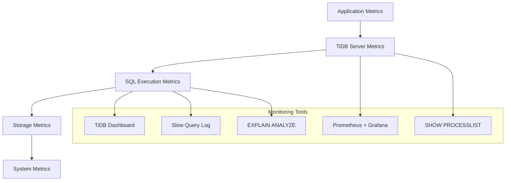

# TiDB Performance Optimization Guide

## Overview

This guide provides comprehensive strategies, techniques, and best practices for optimizing TiDB performance across all layers of the system. It covers query optimization, storage tuning, resource management, and system-level optimizations based on TiDB's internal architecture.

## Table of Contents

1. [Performance Analysis Methodology](#performance-analysis-methodology)
2. [Query Optimization](#query-optimization)
3. [Index Design and Optimization](#index-design-and-optimization)
4. [Storage Layer Optimization](#storage-layer-optimization)
5. [Memory Management](#memory-management)
6. [Concurrency and Parallelism](#concurrency-and-parallelism)
7. [Network and Communication Optimization](#network-and-communication-optimization)
8. [Resource Monitoring and Tuning](#resource-monitoring-and-tuning)
9. [Performance Troubleshooting](#performance-troubleshooting)
10. [Best Practices and Patterns](#best-practices-and-patterns)

## Performance Analysis Methodology

### Performance Monitoring Stack



### Performance Profiling Workflow

```go
// Performance profiling approach
func analyzePerformanceIssue(query string) *PerformanceAnalysis {
    analysis := &PerformanceAnalysis{
        Query: query,
    }

    // 1. Execution plan analysis
    analysis.ExecutionPlan = getExecutionPlan(query)
    analysis.Cost = analyzeCost(analysis.ExecutionPlan)

    // 2. Resource usage analysis
    analysis.MemoryUsage = analyzeMemoryUsage(query)
    analysis.CPUUsage = analyzeCPUUsage(query)
    analysis.IOUsage = analyzeIOUsage(query)

    // 3. Statistics analysis
    analysis.TableStats = getTableStatistics(query)
    analysis.IndexUsage = analyzeIndexUsage(query)

    // 4. Concurrency analysis
    analysis.LockContention = analyzeLockContention(query)
    analysis.ThreadUtilization = analyzeThreadUtilization(query)

    return analysis
}

// Example: Query performance analysis
func performQueryAnalysis(tk *testkit.TestKit, query string) {
    // 1. Get execution plan with statistics
    explainResult := tk.MustQuery(fmt.Sprintf("EXPLAIN ANALYZE %s", query))

    // 2. Check for performance issues
    for _, row := range explainResult.Rows() {
        line := fmt.Sprintf("%v", row)

        // Check for table scan on large tables
        if strings.Contains(line, "TableFullScan") &&
           extractRowCount(line) > 100000 {
            log.Warn("Large table scan detected", zap.String("query", query))
        }

        // Check for excessive memory usage
        if strings.Contains(line, "Memory") &&
           extractMemoryUsage(line) > 1024*1024*1024 { // 1GB
            log.Warn("High memory usage detected", zap.String("query", query))
        }

        // Check for slow operators
        if extractExecutionTime(line) > 1000 { // 1 second
            log.Warn("Slow operator detected", zap.String("query", query))
        }
    }
}
```

### Key Performance Metrics

```go
// Performance metrics collection
type PerformanceMetrics struct {
    // Query execution metrics
    QueryDuration      time.Duration
    RowsExamined      int64
    RowsReturned      int64

    // Resource usage
    MemoryUsage       int64
    CPUTime           time.Duration
    IOOperations      int64

    // Concurrency metrics
    LockWaitTime      time.Duration
    ThreadsActive     int

    // Storage metrics
    TiKVRequests      int64
    NetworkLatency    time.Duration

    // Optimizer metrics
    PlanningTime      time.Duration
    StatisticsUsed    bool
    IndexHitsRatio    float64
}

func collectPerformanceMetrics(query string) *PerformanceMetrics {
    metrics := &PerformanceMetrics{}

    // Collect from various sources
    metrics.QueryDuration = getQueryDuration(query)
    metrics.MemoryUsage = getCurrentMemoryUsage()
    metrics.CPUTime = getCPUTimeUsed()

    return metrics
}
```

## Query Optimization

### Execution Plan Optimization

#### Understanding TiDB's Optimizer

```go
// Cost-based optimization principles
type CostModel struct {
    // CPU costs
    ScanCostFactor    float64  // Cost per row scanned
    FilterCostFactor  float64  // Cost per filter evaluation
    JoinCostFactor    float64  // Cost per join operation

    // Memory costs
    MemoryCostFactor  float64  // Cost per byte in memory
    SortCostFactor    float64  // Cost per row sorted

    // I/O costs
    IOCostFactor      float64  // Cost per I/O operation
    NetworkCostFactor float64  // Cost per network round trip
}

// Example: Join algorithm selection
func selectJoinAlgorithm(leftCard, rightCard int64, availableMemory int64) JoinType {
    // Hash join for large tables with sufficient memory
    if availableMemory > (leftCard * 100) { // Assume 100 bytes per row
        if leftCard > rightCard {
            return HashJoinRightBuild
        }
        return HashJoinLeftBuild
    }

    // Merge join for sorted inputs
    if isInputSorted(leftInput) && isInputSorted(rightInput) {
        return MergeJoin
    }

    // Nested loop for small tables
    if rightCard < 1000 {
        return IndexNestedLoopJoin
    }

    // Fallback to hash join with spilling
    return HashJoinWithSpill
}
```

#### Query Optimization Strategies

```sql
-- 1. Index optimization
-- Bad: Table scan
EXPLAIN SELECT * FROM orders WHERE customer_id = 123;

-- Good: Index scan
CREATE INDEX idx_customer_id ON orders(customer_id);
EXPLAIN SELECT * FROM orders WHERE customer_id = 123;

-- 2. Join optimization
-- Bad: Cartesian product
SELECT o.*, c.name
FROM orders o, customers c
WHERE o.total > 100;

-- Good: Proper join condition
SELECT o.*, c.name
FROM orders o
JOIN customers c ON o.customer_id = c.id
WHERE o.total > 100;

-- 3. Subquery optimization
-- Bad: Correlated subquery
SELECT * FROM customers c
WHERE EXISTS (
    SELECT 1 FROM orders o
    WHERE o.customer_id = c.id AND o.total > 1000
);

-- Good: Join-based approach
SELECT DISTINCT c.*
FROM customers c
JOIN orders o ON c.id = o.customer_id
WHERE o.total > 1000;

-- 4. Predicate pushdown
-- TiDB automatically pushes predicates to storage layer
SELECT /*+ USE_INDEX(o, idx_date) */ o.*, c.name
FROM orders o
JOIN customers c ON o.customer_id = c.id
WHERE o.order_date >= '2023-01-01'  -- Pushed to TiKV
  AND c.region = 'US';              -- Executed after join
```

#### Advanced Optimizer Hints

```sql
-- Force specific join algorithm
SELECT /*+ HASH_JOIN(t1, t2) */ *
FROM table1 t1
JOIN table2 t2 ON t1.id = t2.table1_id;

-- Force index usage
SELECT /*+ USE_INDEX(orders, idx_date_customer) */ *
FROM orders
WHERE order_date >= '2023-01-01'
  AND customer_id = 123;

-- Control join order
SELECT /*+ LEADING(c, o, od) */ *
FROM customers c
JOIN orders o ON c.id = o.customer_id
JOIN order_details od ON o.id = od.order_id;

-- Memory management hints
SELECT /*+ MEMORY_QUOTA(8 GB) */
  customer_id,
  COUNT(*),
  SUM(total)
FROM orders
GROUP BY customer_id;

-- Parallel execution hints
SELECT /*+ HASH_AGG() */
  region,
  COUNT(*),
  AVG(total)
FROM orders
GROUP BY region;
```

### Vectorized Execution Optimization

TiDB uses vectorized execution for improved performance with batch processing.

```go
// Vectorized operation implementation
func vectorizedSum(input *chunk.Chunk, colIndex int) float64 {
    column := input.Column(colIndex)
    data := column.Float64s()
    var sum float64

    // Process in batches for better CPU cache utilization
    batchSize := 1024
    for i := 0; i < len(data); i += batchSize {
        end := i + batchSize
        if end > len(data) {
            end = len(data)
        }

        // Inner loop optimized for vectorization
        for j := i; j < end; j++ {
            if !column.IsNull(j) {
                sum += data[j]
            }
        }
    }

    return sum
}

// SIMD-optimized comparison (pseudo-code)
func vectorizedCompare(left, right *chunk.Column) []bool {
    result := make([]bool, left.Len())
    leftData := left.Int64s()
    rightData := right.Int64s()

    // Process 8 elements at once with SIMD
    for i := 0; i+8 <= len(result); i += 8 {
        // SIMD comparison operation
        results := simdCompareInt64x8(
            leftData[i:i+8],
            rightData[i:i+8]
        )
        copy(result[i:i+8], results)
    }

    // Handle remaining elements
    for i := len(result) &^ 7; i < len(result); i++ {
        result[i] = leftData[i] == rightData[i]
    }

    return result
}
```

## Index Design and Optimization

### Index Strategy Guidelines

#### Primary Key Design

```sql
-- Bad: UUID primary key (poor locality)
CREATE TABLE orders (
    id CHAR(36) PRIMARY KEY,  -- UUID
    customer_id INT,
    order_date DATE,
    total DECIMAL(10,2)
);

-- Good: Auto-increment or SHARD_ROW_ID_BITS
CREATE TABLE orders (
    id BIGINT AUTO_INCREMENT PRIMARY KEY,
    customer_id INT,
    order_date DATE,
    total DECIMAL(10,2)
) SHARD_ROW_ID_BITS = 4;  -- Distribute across regions

-- Alternative: Composite key with good distribution
CREATE TABLE orders (
    region_id INT,
    order_id BIGINT AUTO_INCREMENT,
    customer_id INT,
    order_date DATE,
    total DECIMAL(10,2),
    PRIMARY KEY (region_id, order_id)
);
```

#### Secondary Index Optimization

```sql
-- Multi-column index design
-- Bad: Separate indexes
CREATE INDEX idx_customer ON orders(customer_id);
CREATE INDEX idx_date ON orders(order_date);

-- Good: Composite index for common query patterns
CREATE INDEX idx_customer_date ON orders(customer_id, order_date);
CREATE INDEX idx_date_customer ON orders(order_date, customer_id);

-- Covering index to avoid table lookups
CREATE INDEX idx_customer_covering ON orders(customer_id, order_date, total);

-- Functional index for computed values
CREATE INDEX idx_year_month ON orders((YEAR(order_date)), (MONTH(order_date)));
```

#### Index Maintenance and Statistics

```go
// Index maintenance strategy
func maintainIndexStatistics() {
    // Regular statistics collection
    scheduleStatisticsCollection := func() {
        tables := getAllTables()
        for _, table := range tables {
            if needsStatisticsUpdate(table) {
                executeAnalyzeTable(table)
            }
        }
    }

    // Monitor index usage
    monitorIndexUsage := func() {
        unusedIndexes := findUnusedIndexes()
        for _, index := range unusedIndexes {
            if index.CreationTime.Before(time.Now().AddDate(0, -1, 0)) {
                logWarning("Unused index detected: %s", index.Name)
            }
        }
    }

    // Schedule regular maintenance
    go scheduleRegularMaintenance(scheduleStatisticsCollection, monitorIndexUsage)
}

// Statistics quality assessment
func assessStatisticsQuality(table string) *StatisticsQuality {
    stats := getTableStatistics(table)
    return &StatisticsQuality{
        Freshness:    time.Since(stats.LastUpdate),
        Accuracy:     calculateAccuracy(stats),
        Completeness: calculateCompleteness(stats),
        Coverage:     calculateIndexCoverage(stats),
    }
}
```

## Storage Layer Optimization

### TiKV Optimization Strategies

#### Region and Key Distribution

```go
// Region split strategy for hot keys
func optimizeRegionDistribution(hotKeys []string) {
    for _, key := range hotKeys {
        // Split regions to distribute load
        splitRegion(key)

        // Schedule region leaders to different stores
        scheduleLeaderDistribution(key)
    }
}

// Key design for even distribution
func generateDistributedKey(userID int64, timestamp time.Time) []byte {
    // Add shard prefix to distribute load
    shard := userID % 256

    var buf bytes.Buffer
    buf.WriteByte(byte(shard))                    // Shard prefix
    binary.Write(&buf, binary.BigEndian, userID) // User ID
    binary.Write(&buf, binary.BigEndian, timestamp.Unix()) // Timestamp

    return buf.Bytes()
}

// Table key encoding optimization
func optimizeTableKeyEncoding(tableID int64, rowID int64) []byte {
    // TiDB table key format: t{tableID}_r{rowID}
    // Use efficient encoding to minimize key size
    key := make([]byte, 0, 16)
    key = append(key, 't')
    key = codec.EncodeInt(key, tableID)
    key = append(key, '_', 'r')
    key = codec.EncodeInt(key, rowID)
    return key
}
```

#### Coprocessor Optimization

```go
// Pushdown optimization
func optimizeCoprocessorPushdown(plan PhysicalPlan) *tipb.DAGRequest {
    dagReq := &tipb.DAGRequest{}

    // Push down as much computation as possible
    pushdownableOperators := []PhysicalPlan{}

    // Selection pushdown
    if selection, ok := plan.(*PhysicalSelection); ok {
        if canPushdownToTiKV(selection.Conditions) {
            pushdownableOperators = append(pushdownableOperators, selection)
        }
    }

    // Aggregation pushdown
    if agg, ok := plan.(*PhysicalHashAgg); ok {
        if canPushdownAggregation(agg) {
            pushdownableOperators = append(pushdownableOperators, agg)
        }
    }

    // TopN pushdown
    if limit, ok := plan.(*PhysicalLimit); ok {
        if hasOrderBy(limit) {
            pushdownableOperators = append(pushdownableOperators, limit)
        }
    }

    // Build DAG request
    for _, op := range pushdownableOperators {
        executor := convertToTiPBExecutor(op)
        dagReq.Executors = append(dagReq.Executors, executor)
    }

    return dagReq
}

// Batch optimization for coprocessor requests
func optimizeBatchProcessing(ranges []*ranger.Range) []*tipb.KeyRange {
    // Merge adjacent ranges to reduce round trips
    mergedRanges := mergeAdjacentRanges(ranges)

    // Split large ranges to enable parallel processing
    var result []*tipb.KeyRange
    for _, r := range mergedRanges {
        if estimateRangeSize(r) > maxBatchSize {
            subRanges := splitRange(r, maxBatchSize)
            result = append(result, subRanges...)
        } else {
            result = append(result, convertToTiPBRange(r))
        }
    }

    return result
}
```

### Transaction Optimization

#### Two-Phase Commit Optimization

```go
// Optimized 2PC implementation
type OptimizedCommitter struct {
    mutations    map[string]*pb.Mutation
    primaryKey   []byte
    startTS      uint64

    // Optimization parameters
    batchSize    int
    concurrency  int
    useAsyncCommit bool
    use1PC       bool
}

func (c *OptimizedCommitter) execute(ctx context.Context) error {
    // Optimization 1: Use 1PC for single-region transactions
    if c.use1PC && c.isSingleRegion() {
        return c.executeOnePhaseCommit(ctx)
    }

    // Optimization 2: Use async commit for fast response
    if c.useAsyncCommit {
        return c.executeAsyncCommit(ctx)
    }

    // Standard 2PC with optimizations
    return c.executeTwoPhaseCommit(ctx)
}

func (c *OptimizedCommitter) executeAsyncCommit(ctx context.Context) error {
    // Prewrite phase with async commit flag
    prewriteReq := &kvrpcpb.PrewriteRequest{
        Mutations:        c.buildMutations(),
        PrimaryLock:      c.primaryKey,
        StartVersion:     c.startTS,
        UseAsyncCommit:   true,
        Secondaries:      c.getSecondaryKeys(),
    }

    _, err := c.sendPrewriteRequests(ctx, prewriteReq)
    if err != nil {
        return err
    }

    // Return immediately without waiting for commit
    go c.asyncCommitSecondaries(ctx)
    return nil
}

func (c *OptimizedCommitter) batchMutations() [][]*pb.Mutation {
    var batches [][]*pb.Mutation
    var currentBatch []*pb.Mutation
    currentSize := 0

    for _, mutation := range c.mutations {
        mutationSize := len(mutation.Key) + len(mutation.Value)

        if currentSize+mutationSize > c.batchSize && len(currentBatch) > 0 {
            batches = append(batches, currentBatch)
            currentBatch = nil
            currentSize = 0
        }

        currentBatch = append(currentBatch, mutation)
        currentSize += mutationSize
    }

    if len(currentBatch) > 0 {
        batches = append(batches, currentBatch)
    }

    return batches
}
```

## Memory Management

### Memory Usage Optimization

#### Memory Tracking and Control

```go
// Memory tracker implementation
type MemoryTracker struct {
    label         string
    parent        *MemoryTracker
    mu            sync.RWMutex

    consumed      int64
    maxConsumed   int64

    // Memory control
    bytesLimit    int64
    actionOnExceed ActionOnExceed

    // Children trackers
    children      map[string]*MemoryTracker
}

func (t *MemoryTracker) Consume(bytes int64) {
    t.mu.Lock()
    defer t.mu.Unlock()

    t.consumed += bytes
    if t.consumed > t.maxConsumed {
        t.maxConsumed = t.consumed
    }

    // Check memory limit
    if t.bytesLimit > 0 && t.consumed > t.bytesLimit {
        t.handleMemoryExceed()
    }

    // Propagate to parent
    if t.parent != nil {
        t.parent.Consume(bytes)
    }
}

func (t *MemoryTracker) handleMemoryExceed() {
    switch t.actionOnExceed {
    case ActionLog:
        logMemoryExceed(t)
    case ActionSpill:
        triggerSpilling(t)
    case ActionCancel:
        cancelOperation(t)
    case ActionPanic:
        panic(fmt.Sprintf("Memory limit exceeded: %s", t.label))
    }
}

// Memory pool for frequently allocated objects
type ChunkPool struct {
    pools map[int]*sync.Pool
    mu    sync.RWMutex
}

func NewChunkPool() *ChunkPool {
    cp := &ChunkPool{
        pools: make(map[int]*sync.Pool),
    }

    // Pre-create pools for common chunk sizes
    for _, size := range []int{1024, 4096, 16384, 65536} {
        cp.getOrCreatePool(size)
    }

    return cp
}

func (cp *ChunkPool) Get(capacity int) *chunk.Chunk {
    pool := cp.getOrCreatePool(capacity)
    if obj := pool.Get(); obj != nil {
        chk := obj.(*chunk.Chunk)
        chk.Reset()
        return chk
    }

    return chunk.New(nil, capacity, capacity)
}

func (cp *ChunkPool) Put(chk *chunk.Chunk) {
    if chk.Capacity() > 1024*1024 { // Don't pool very large chunks
        return
    }

    pool := cp.getOrCreatePool(chk.Capacity())
    pool.Put(chk)
}
```

#### Spill-to-Disk Strategy

```go
// Spill-to-disk implementation for large operations
type SpillableHashTable struct {
    inMemoryTable  map[string][]chunk.Row
    spilledFiles   []*os.File
    memoryLimit    int64
    currentMemory  int64

    memTracker     *MemoryTracker
    diskTracker    *DiskTracker
}

func (h *SpillableHashTable) Insert(key string, row chunk.Row) error {
    // Check memory pressure
    if h.shouldSpill() {
        if err := h.spillPartition(key); err != nil {
            return err
        }
    }

    // Insert into in-memory table
    h.inMemoryTable[key] = append(h.inMemoryTable[key], row)

    // Track memory usage
    rowSize := estimateRowSize(row)
    h.currentMemory += rowSize
    h.memTracker.Consume(rowSize)

    return nil
}

func (h *SpillableHashTable) shouldSpill() bool {
    return h.currentMemory > h.memoryLimit
}

func (h *SpillableHashTable) spillPartition(excludeKey string) error {
    // Find partition to spill (LRU or size-based)
    spillKey := h.selectSpillPartition(excludeKey)
    rows := h.inMemoryTable[spillKey]

    // Create spill file
    spillFile, err := h.createSpillFile()
    if err != nil {
        return err
    }

    // Write partition to disk
    encoder := newRowEncoder(spillFile)
    for _, row := range rows {
        if err := encoder.EncodeRow(row); err != nil {
            return err
        }
    }

    // Remove from memory
    memoryFreed := h.estimatePartitionSize(spillKey)
    delete(h.inMemoryTable, spillKey)
    h.currentMemory -= memoryFreed
    h.memTracker.Consume(-memoryFreed)

    // Track disk usage
    h.diskTracker.Consume(memoryFreed)
    h.spilledFiles = append(h.spilledFiles, spillFile)

    return nil
}

func (h *SpillableHashTable) Probe(key string) ([]chunk.Row, error) {
    // Check in-memory table first
    if rows, exists := h.inMemoryTable[key]; exists {
        return rows, nil
    }

    // Search spilled files
    return h.probeSpilledFiles(key)
}
```

## Concurrency and Parallelism

### Parallel Execution Optimization

#### Join Parallelization

```go
// Parallel hash join implementation
type ParallelHashJoinExec struct {
    baseExecutor

    buildChild    Executor
    probeChild    Executor

    // Parallel execution parameters
    concurrency   int
    buildWorkers  []*hashJoinBuildWorker
    probeWorkers  []*hashJoinProbeWorker

    // Coordination
    buildFinished chan error
    resultChan    chan *joinResult
    wg           sync.WaitGroup
}

func (e *ParallelHashJoinExec) Open(ctx context.Context) error {
    if err := e.baseExecutor.Open(ctx); err != nil {
        return err
    }

    // Start build phase workers
    e.buildFinished = make(chan error, 1)
    go e.startBuildWorkers(ctx)

    return nil
}

func (e *ParallelHashJoinExec) startBuildWorkers(ctx context.Context) {
    defer close(e.buildFinished)

    // Partition build side data
    partitions := make([]*hashPartition, e.concurrency)
    for i := range partitions {
        partitions[i] = newHashPartition()
    }

    // Build hash tables in parallel
    var buildWg sync.WaitGroup
    for i := 0; i < e.concurrency; i++ {
        buildWg.Add(1)
        go func(partitionID int) {
            defer buildWg.Done()
            e.buildPartition(ctx, partitions[partitionID])
        }(i)
    }

    buildWg.Wait()

    // Start probe phase workers
    e.startProbeWorkers(ctx, partitions)

    e.buildFinished <- nil
}

func (e *ParallelHashJoinExec) startProbeWorkers(ctx context.Context, partitions []*hashPartition) {
    e.resultChan = make(chan *joinResult, e.concurrency)

    for i := 0; i < e.concurrency; i++ {
        e.wg.Add(1)
        go func(workerID int) {
            defer e.wg.Done()
            e.probeWorker(ctx, workerID, partitions[workerID])
        }(i)
    }

    // Close result channel when all workers finish
    go func() {
        e.wg.Wait()
        close(e.resultChan)
    }()
}

func (e *ParallelHashJoinExec) probeWorker(ctx context.Context, workerID int, partition *hashPartition) {
    for {
        select {
        case <-ctx.Done():
            return
        default:
            // Get probe batch
            probeBatch, err := e.getProbeChunk(workerID)
            if err != nil {
                return
            }

            if probeBatch.NumRows() == 0 {
                return // No more data
            }

            // Probe hash table
            joinResult := e.probeHashTable(probeBatch, partition)

            // Send result
            select {
            case e.resultChan <- joinResult:
            case <-ctx.Done():
                return
            }
        }
    }
}
```

#### Aggregation Parallelization

```go
// Parallel aggregation execution
type ParallelHashAggExec struct {
    baseExecutor

    // Aggregation configuration
    groupByExprs    []expression.Expression
    aggFuncs        []aggfuncs.AggFunc

    // Parallel execution
    concurrency     int
    inputChan       chan *chunk.Chunk
    partialResultChan chan *partialAggResult
    finalResultChan   chan *chunk.Chunk

    // Worker coordination
    workers         []*aggWorker
    finalWorker     *aggFinalWorker
}

func (e *ParallelHashAggExec) executeParallelAgg(ctx context.Context) error {
    // Phase 1: Partial aggregation in parallel
    e.startPartialAggWorkers(ctx)

    // Phase 2: Final aggregation
    e.startFinalAggWorker(ctx)

    // Phase 3: Input distribution
    go e.distributeInput(ctx)

    return nil
}

func (e *ParallelHashAggExec) startPartialAggWorkers(ctx context.Context) {
    e.inputChan = make(chan *chunk.Chunk, e.concurrency*2)
    e.partialResultChan = make(chan *partialAggResult, e.concurrency)

    for i := 0; i < e.concurrency; i++ {
        worker := &aggWorker{
            workerID:     i,
            inputChan:    e.inputChan,
            outputChan:   e.partialResultChan,
            groupByExprs: e.groupByExprs,
            aggFuncs:     e.cloneAggFuncs(),
            hashMap:      make(map[string][]aggfuncs.PartialResult),
        }

        e.workers = append(e.workers, worker)
        go worker.run(ctx)
    }
}

func (w *aggWorker) run(ctx context.Context) {
    defer func() {
        // Send partial results when worker finishes
        for groupKey, partialResults := range w.hashMap {
            w.outputChan <- &partialAggResult{
                GroupKey:       groupKey,
                PartialResults: partialResults,
            }
        }
    }()

    for {
        select {
        case chunk := <-w.inputChan:
            if chunk == nil {
                return // No more input
            }

            w.processChunk(chunk)

        case <-ctx.Done():
            return
        }
    }
}

func (w *aggWorker) processChunk(chk *chunk.Chunk) {
    // Process each row in the chunk
    for i := 0; i < chk.NumRows(); i++ {
        row := chk.GetRow(i)

        // Evaluate group by expressions
        groupKey := w.buildGroupKey(row)

        // Get or create partial results for this group
        partialResults, exists := w.hashMap[groupKey]
        if !exists {
            partialResults = make([]aggfuncs.PartialResult, len(w.aggFuncs))
            for j, aggFunc := range w.aggFuncs {
                partialResults[j] = aggFunc.AllocPartialResult()
            }
            w.hashMap[groupKey] = partialResults
        }

        // Update aggregation functions
        for j, aggFunc := range w.aggFuncs {
            aggFunc.UpdatePartialResult(w.ctx, []chunk.Row{row}, partialResults[j])
        }
    }
}
```

### Lock Optimization

#### Optimistic Locking Strategy

```go
// Optimistic transaction implementation
type OptimisticTransaction struct {
    startTS      uint64
    mutations    map[string]*pb.Mutation
    readSet      map[string]uint64  // key -> version
    writeSet     map[string][]byte  // key -> value

    conflictRetries int
    maxRetries      int
}

func (txn *OptimisticTransaction) Get(ctx context.Context, key []byte) ([]byte, error) {
    keyStr := string(key)

    // Check local write set first
    if value, exists := txn.writeSet[keyStr]; exists {
        return value, nil
    }

    // Read from storage
    snapshot := txn.getSnapshot()
    value, err := snapshot.Get(ctx, key)
    if err != nil {
        return nil, err
    }

    // Record read version for conflict detection
    txn.readSet[keyStr] = snapshot.GetTS()

    return value, nil
}

func (txn *OptimisticTransaction) Prewrite(ctx context.Context) error {
    // Check for conflicts
    conflicts := txn.detectConflicts(ctx)
    if len(conflicts) > 0 {
        return &ConflictError{
            ConflictKeys: conflicts,
            RetryAfter:   calculateBackoff(txn.conflictRetries),
        }
    }

    // Perform prewrite
    return txn.doPrewrite(ctx)
}

func (txn *OptimisticTransaction) detectConflicts(ctx context.Context) []string {
    var conflicts []string

    for key, readVersion := range txn.readSet {
        // Check if key was modified after read
        currentVersion, err := txn.getKeyVersion(ctx, key)
        if err != nil {
            continue
        }

        if currentVersion > readVersion {
            conflicts = append(conflicts, key)
        }
    }

    return conflicts
}

// Retry logic with exponential backoff
func (txn *OptimisticTransaction) ExecuteWithRetry(ctx context.Context, fn func() error) error {
    for retries := 0; retries < txn.maxRetries; retries++ {
        err := fn()
        if err == nil {
            return nil
        }

        if conflictErr, ok := err.(*ConflictError); ok {
            // Exponential backoff
            backoff := time.Duration(1<<uint(retries)) * time.Millisecond
            if conflictErr.RetryAfter > backoff {
                backoff = conflictErr.RetryAfter
            }

            select {
            case <-time.After(backoff):
                txn.conflictRetries++
                continue
            case <-ctx.Done():
                return ctx.Err()
            }
        }

        return err // Non-retryable error
    }

    return fmt.Errorf("transaction failed after %d retries", txn.maxRetries)
}
```

This comprehensive performance optimization guide provides developers with the knowledge and tools needed to optimize TiDB performance across all layers of the system. The strategies cover everything from high-level query optimization to low-level memory management and concurrency control.